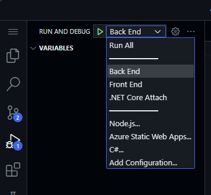
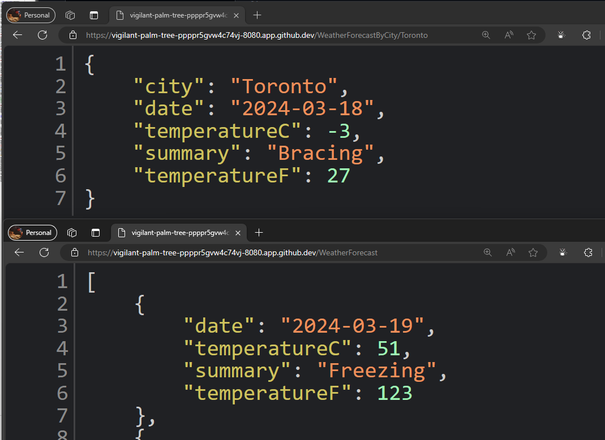

<header>

# Harnessing GitHub Copilot with C#

GitHub Copilot is the world's first at-scale AI developer tool that significantly accelerates code writing by providing autocomplete-style suggestions as you work. In this module, we will focus on harnessing the power of GitHub Copilot to enhance your C# coding efficiency.

As a developer, your goal is to boost productivity and speed up coding processes. GitHub Copilot acts as your AI pair programmer, offering suggestions based on context and code patterns. By the end of this module, you'll not only know how to configure GitHub Copilot in Codespaces but also how to generate and implement code suggestions effectively.

Get ready to dive into a real-world scenario! You'll be modifying a C# repository using GitHub Copilot to create an interactive HTML form and an API endpoint. This project will give you valuable experience in developing a C# web app that serves an HTTP API, generating pseudo-random tokens for identification purposes.

</header>


- **Who this is for**: Developers, DevOps Engineers, Software development managers, Testers.
- **What you'll learn**: Harnessing GitHub Copilot to create code and add comments to your work.
- **What you'll build**: C# files that will have code generated by Copilot AI for code and comment suggestions.
- **Prerequisites**: To use GitHub Copilot you must have an active GitHub Copilot subscription. Sign up for 30 days free [Copilot](https://github.com/settings/copilot).
- **Timing**: This course can be completed in under an hour.

By the end of this module, you'll acquire the skills to be able to:

- Configure a GitHub repository in Codespaces and install GitHub Copilot extension.
- Crafted prompts to generate suggestions from GitHub Copilot
- Applied GitHub Copilot to improve your projects.

## Prerequisite reading:
- [Introduction to prompt engineering with GitHub Copilot](https://learn.microsoft.com/training/modules/introduction-prompt-engineering-with-github-copilot?WT.mc_id=academic-113596-abartolo)

- [What is the GitHub Copilot extension for Visual Studio?](https://learn.microsoft.com/en-us/visualstudio/ide/visual-studio-github-copilot-extension?view=vs-2022&WT.mc_id=academic-113596-abartolo)

## Requirements

1. Enable your [GitHub Copilot service](https://github.com/github-copilot/signup)

1. Open [this repository with Codespaces](https://github.com/github/dotnet-codespaces)

## 💪🏽 Exercise

[](https://codespaces.new/github/dotnet-codespaces)

This repository builds a Weather API using Minimal APIs, opens Swagger so you can call and test the API, and displays the data in a web application using Blazor with .NET 8.
We will review the steps to update the Weather BackEnd App by adding a new endpoint that request a specific location and return the weather forecast for that location.

### 🗒️ Step 1: Generate a new Record that includes the City name

Go to the `Program.cs` file in the BackEnd project. The file is in the following path `SampleApp\BackEnd\Program.cs`. 

[]

Navigate to the end of the file and ask Copilot to generate a new record that includes the name of the city.

```csharp
// internal record WeatherForecastByCity that request the following parameters:
// City, Date, TemperatureC, Summary
```

The generated code sould be similar to this one:

```csharp
// internal record WeatherForecastByCity that request the following parameters:
// City, Date, TemperatureC, Summary
internal record WeatherForecastByCity(string City, DateOnly Date, int TemperatureC, string? Summary)
{
    public int TemperatureF => 32 + (int)(TemperatureC / 0.5556);
}
```
### 🔎 Step 2: Generate a new endpoint to get the weather forecast for a city

Now let's generate a new API endpoint for the "/weatherforecast" that also includes the city name. The new API endpoint name will be **"/weatherforecastbycity"**.

Next, generate a new endpoint with GitHub Copilot by adding the comment: 

```csharp
// Create a new endpoint named /WeatherForecastByCity that accepts a city name and generates a random forecast for that city
```


***Important:** You must place the code in line 36, after the '.WithOpenApi();' line. Also remember to press TAB in each new suggested line until the whole endpoint is defined.*


The generated code should look similar to this one:


```csharp
// Create a new endpoint named /weatherforecastbycity/{city}
// the endpoing  accepts a city name and generates a random forecast for that city
app.MapGet("/weatherforecastbycity/{city}", (string city) =>
{
    var forecast = new WeatherForecastByCity
    (
        city,
        DateOnly.FromDateTime(DateTime.Now),
        Random.Shared.Next(-20, 55),
        summaries[Random.Shared.Next(summaries.Length)]
    );
    return forecast;
})
.WithName("GetWeatherForecastByCity")
.WithOpenApi();
```

### 🐍 Step 3: Test the new endpoint.

Finally, verify the new endpoint is working by starting the project from the Run and Debug panel. 
Select Run and Debug, and then select the BackEnd project.



Now press Run and the project should build and run. Once the project is running we can test the original url using your codespace url and the original endpoint:

```bash
https://< your code space url >.app.github.dev/WeatherForecast
```

And the new endpoint will be also ready to test
```bash
https://< your code space url >.app.github.dev/WeatherForecastByCity/Toronto
```

Both tests running should be similar to these ones:




🚀 Congratulations, through the exercise, you haven't only used copilot to generate code but also done it in an interactive and fun way! You can use GitHub Copilot to not only generate code, but write documentation, test your applications and more.


## Legal Notices

Microsoft and any contributors grant you a license to the Microsoft documentation and other content
in this repository under the [Creative Commons Attribution 4.0 International Public License](https://creativecommons.org/licenses/by/4.0/legalcode),
see the [LICENSE](LICENSE) file, and grant you a license to any code in the repository under the [MIT License](https://opensource.org/licenses/MIT), see the
[LICENSE-CODE](LICENSE-CODE) file.

Microsoft, Windows, Microsoft Azure and/or other Microsoft products and services referenced in the documentation
may be either trademarks or registered trademarks of Microsoft in the United States and/or other countries.
The licenses for this project do not grant you rights to use any Microsoft names, logos, or trademarks.
Microsoft's general trademark guidelines can be found at http://go.microsoft.com/fwlink/?LinkID=254653.

Privacy information can be found at https://privacy.microsoft.com/en-us/

Microsoft and any contributors reserve all other rights, whether under their respective copyrights, patents,
or trademarks, whether by implication, estoppel or otherwise.
