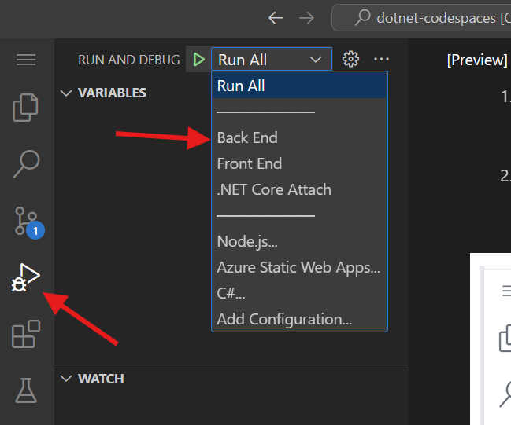
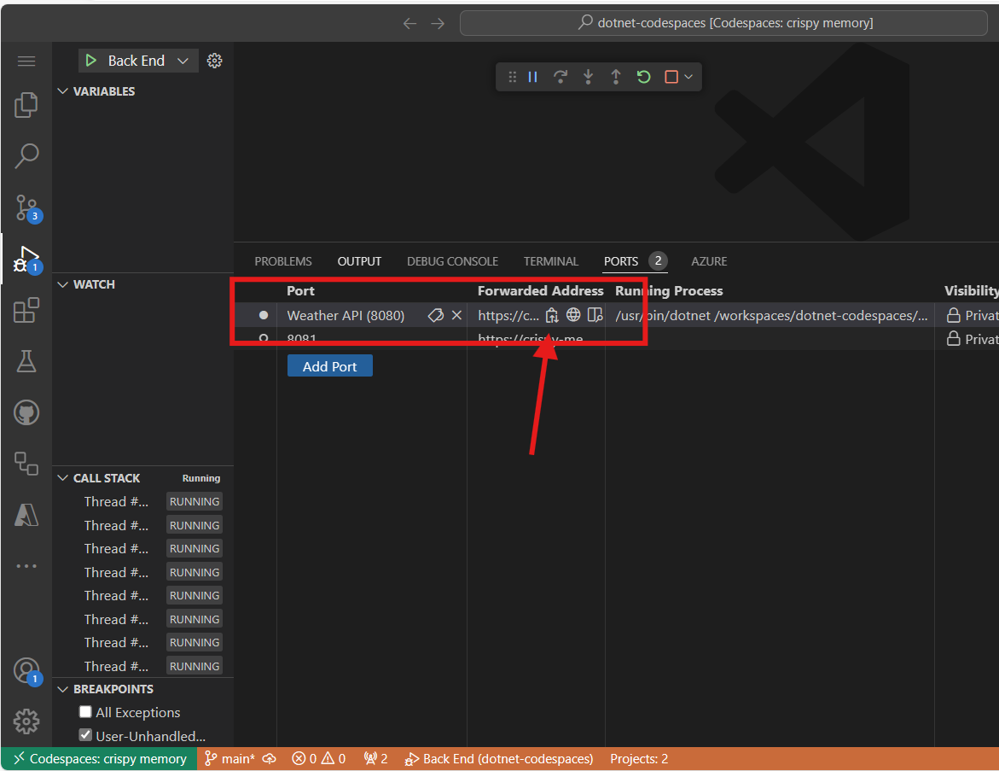
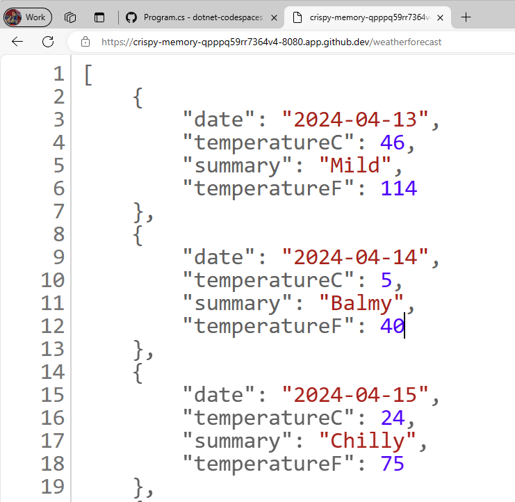
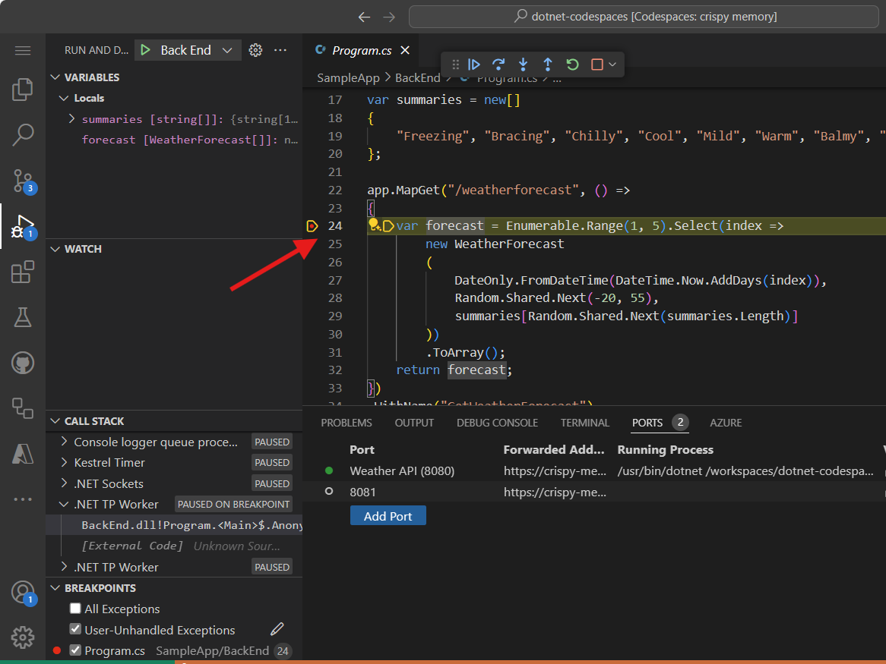
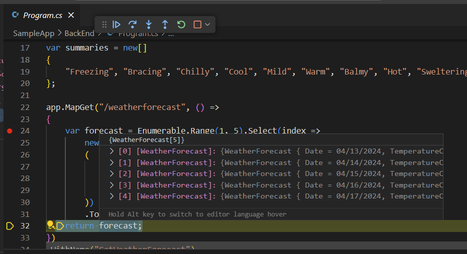
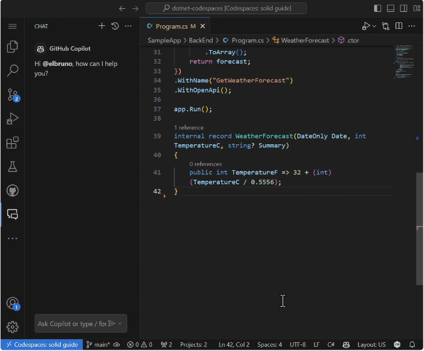
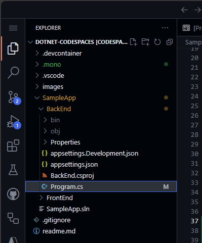
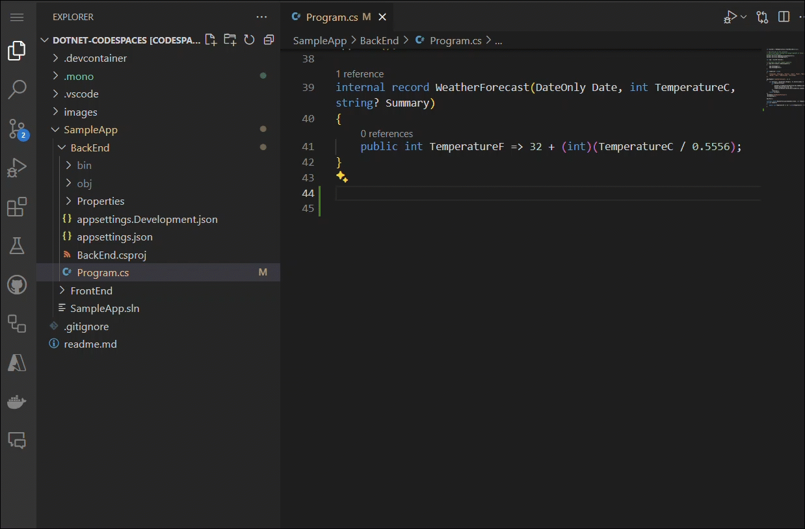

<header>

# Using GitHub Copilot with C#

GitHub Copilot is the first large-scale AI developer tool designed to revolutionize coding by providing intelligent, autocomplete-style suggestions as you write. In this module, we’ll explore how to leverage GitHub Copilot to enhance your efficiency when coding in C#.

As a developer, maximizing productivity and streamlining the coding process are key objectives. GitHub Copilot serves as your AI-powered pair programmer, delivering context-aware suggestions tailored to your code. By the end of this module, you’ll learn how to configure GitHub Copilot in Codespaces and harness its capabilities to generate and implement code suggestions with ease.

Prepare to tackle a practical, hands-on project! You’ll work on modifying a C# repository to create an API endpoint using GitHub Copilot. This exercise will provide valuable experience in building a C# web application that serves an HTTP API and generates pseudo-random weather forecast data.

</header>


- **Who this is for**: Developers, DevOps Engineers, Software development managers, Testers.
- **What you'll learn**: How to use GitHub Copilot to create code and add comments to your work.
- **What you'll build**: C# files that will have code generated by Copilot AI for code and comment suggestions.
- **Prerequisites**: GitHub Copilot is available to use for free, sign up for [GitHub Copilot](https://gh.io/copilot).
- **Timing**: This course can be completed in under an hour.

By the end of this module, you'll acquire the skills to be able to:

- Crafted prompts to generate suggestions from GitHub Copilot
- Applied GitHub Copilot to improve your projects.

## Prerequisite reading:
- [Introduction to prompt engineering with GitHub Copilot](https://learn.microsoft.com/training/modules/introduction-prompt-engineering-with-github-copilot?WT.mc_id=academic-113596-abartolo)

- [What is the GitHub Copilot extension for Visual Studio?](https://learn.microsoft.com/en-us/visualstudio/ide/visual-studio-github-copilot-extension?view=vs-2022&WT.mc_id=academic-113596-abartolo)

## Requirements

1. Enable your [GitHub Copilot service](https://github.com/github-copilot/signup)

1. Get familiar with [this repository with Codespaces](https://github.com/github/dotnet-codespaces)

## 💪🏽 Exercise

**Right click the following Codespaces button to open your Codespace in a new tab**
 
[](https://codespaces.new/github/dotnet-codespaces)

The "**GitHub Codespaces ♥️ .NET 8**" repository builds a Weather API using Minimal APIs, opens Swagger so you can call and test the API, and displays the data in a web application using Blazor with .NET 8.


We will review the steps to update the Weather BackEnd App by adding a new endpoint that requests a specific location and returns the weather forecast for that location.


### 🗒️ Step 1: Get familiarized with the "GitHub Codespaces ♥️ .NET 8" repository

Once you open the repository in Codespaces, you will find a new browser window with a fully functional Codespace. Everything in this repository is contained within this one Codespace. In example, in the explorer panel, we can see the main code for the BackEnd and the FrontEnd project.


In order to run the BackEnd project, go to the "Run and Debug" panel, and select the "BackEnd" Project.



Start Debugging the selected project. The Weather API project, our BackEnd project will now be running in port 8080. We can copy the published url from the *Ports* panel



The BackEnd application published an endpoint named `weatherforecast` that generates random forecast data. To test the current running application, you can add `/weatherforecast` to the published url. The final url should be similar to this one

```bash
https://< your url>.app.github.dev/weatherforecast
```
The running application in a browser should be like this one.



Now let's add a break point into our application, to debug each call to the API. Go to the `Program.cs` file in the BackEnd project. The file is in the following path `SampleApp\BackEnd\Program.cs`. 

Add a breakpoint in line 24 (press F9) and refresh the browser with the Url to test the endpoint. The browser should not show the weather forecast, and in the Visual Studio Editor we can see how the program execution was paused at line 24.



Pressing F10 we can debug step-by-step until line 32, where we can see the generated values. The application should have been generated samples Weather values for the next 5 days. The variable `forecast` has an array containing these values.



You can stop debugging now.


Congratulations! Now you are ready to add more features into the app using GitHub Copilot.

### 🗒️ Step 2: Get familiarized with GitHub Copilot Slash Commands

As we start working in our codebase, we usually need to refactor some code, or get more context or explanations about it. Using GitHub Copilot Chat, we can have AI-driven conversations to perform these tasks. 

Open the file `Program.cs` in the BackEnd project. The file is in the following path `SampleApp\BackEnd\Program.cs`. 

Now let's use a slash command, in GitHub Copilot to understand a piece of code. Select lines 22-35, press `CTRL + I` to open the inline chat, and type `/explain`.


In the Chat Panel, GitHub Copilot will create a detailed explanation of the selected code. A summarized version will be like this one:

```
The selected C# code is part of an ASP.NET Core application using the minimal API feature. It defines a GET endpoint at "/weatherforecast" that generates an array of WeatherForecast objects. Each object is created with a date, a random temperature, and a random summary. The endpoint is named "GetWeatherForecast" and has OpenAPI support for standardized API structure documentation.
```

**Slash commands** are special commands that you can use in chat to perform specific actions on your code. For example, you can use: 
- `/doc` to add a documentation comment 
- `/explain` to explain the code 
- `/fix` to propose a fix for the problems in the selected code 
- `/generate` to generate code to answer your question

Let's use the `/tests` command to generate tests to the code. Select lines 39-42, press `CTRL + I` to open the inline chat, and type `/tests` (or select the /tests slash command) to generate a new set of tests for this record.



At this point, GitHub Copilot will suggest a new class. You need to first press [Create] to create the new file. 

A new class `ProgramTests.cs` was created and added to the project. This tests are using XUnit, however, you can ask to generate tests using another Unit Test library with a command like this one `/tests use MSTests for unit testing`.

***Important:** We are not going to use the test file in this project. You must delete the generated test file to continue.*

Finally, let's use the `/doc` to generate automatic documentation to the code. Select lines 39-42, press `CTRL + I` to open the inline chat, and type `/doc` (or select the command) to generate the documentation for this record.


Inline chat, the Chat Panel, and slash commands are part of the amazing tools that support our development experience with GitHub Copilot. Now we are ready to add new features to this App.


### 🗒️ Step 3: Generate a new Record that includes the city name

Go to the `Program.cs` file in the BackEnd project. The file is in the following path `SampleApp\BackEnd\Program.cs`. 



Navigate to the end of the file and ask Copilot to generate a new record that includes the name of the city.

```csharp
// create a new internal record named WeatherForecastByCity that request the following parameters: City, Date, TemperatureC, Summary
```

The generated code sould be similar to this one:

```csharp
// create a new internal record named WeatherForecastByCity that request the following parameters: City, Date, TemperatureC, Summary
internal record WeatherForecastByCity(string City, DateOnly Date, int TemperatureC, string? Summary)
{
    public int TemperatureF => 32 + (int)(TemperatureC / 0.5556);
}
```

You can take a look at the prompt working in the next animation:



### 🔎 Step 4: Generate a new endpoint to get the weather forecast for a city

Now let's generate a new API endpoint similar to `/weatherforecast` that also includes the city name. The new API endpoint name will be **`/weatherforecastbycity`**.

***Important:** You must place the code after the '.WithOpenApi();' line, this starts in line 36. Also remember to press TAB in each new suggested line until the whole endpoint is defined.*

Next, generate a new endpoint with GitHub Copilot by adding the comment: 

```csharp
// Create a new endpoint named /WeatherForecastByCity/{city}, that accepts a city name in the urls as a paremeter and generates a random forecast for that city
```
In the following example, we added some extra blank lines after the previous endpoint and then GitHub Copilot generated the new endpoint. Once the Endpoint core code was generated, GitHub Copilot also suggested code for the name of the endpoint (line 49) and the OpenAPI specification (line 50). Remember to accept each one of these suggestions pressing [TAB].


***Important**: This prompt generates several lines of C# code. It's strongly adviced to check and review the generated code to verify that it works in the desired way.*

The generated code should look similar to this one:

```csharp
// Create a new endpoint named /WeatherForecastByCity/{city}, that accepts a city name in the urls as a paremeter and generates a random forecast for that city
app.MapGet("/WeatherForecastByCity/{city}", (string city) =>
{
    var forecast = new WeatherForecastByCity
    (
        city,
        DateOnly.FromDateTime(DateTime.Now),
        Random.Shared.Next(-20, 55),
        summaries[Random.Shared.Next(summaries.Length)]
    );
    return forecast;
})
.WithName("GetWeatherForecastByCity")
.WithOpenApi();
```


### 🐍 Step 5: Test the new endpoint.

Finally, verify the new endpoint is working by starting the project from the Run and Debug panel. 
Select Run and Debug, and then select the BackEnd project.


Now press Run and the project should build and run. Once the project is running, we can test the original Url using your Codespace url and the original endpoint:

```bash
https://< your code space url >.app.github.dev/WeatherForecast
```

And the new endpoint will be also ready to test. Here are some samples urls with different cities:
```bash
https://< your code space url >.app.github.dev/WeatherForecastByCity/Toronto

https://< your code space url >.app.github.dev/WeatherForecastByCity/Madrid

https://< your code space url >.app.github.dev/WeatherForecastByCity/<AnyCityName>
```

Both tests running should be like these ones:


🚀 Congratulations, through the exercise, you haven't only used GitHub Copilot  to generate code but also done it in an interactive and fun way! You can use GitHub Copilot to not only generate code, but write documentation, test your applications and more.


## Legal Notices

Microsoft and any contributors grant you a license to the Microsoft documentation and other content
in this repository under the [Creative Commons Attribution 4.0 International Public License](https://creativecommons.org/licenses/by/4.0/legalcode),
see the [LICENSE](LICENSE) file, and grant you a license to any code in the repository under the [MIT License](https://opensource.org/licenses/MIT), see the
[LICENSE-CODE](LICENSE-CODE) file.

Microsoft, Windows, Microsoft Azure and/or other Microsoft products and services referenced in the documentation
may be either trademarks or registered trademarks of Microsoft in the United States and/or other countries.
The licenses for this project do not grant you rights to use any Microsoft names, logos, or trademarks.
Microsoft's general trademark guidelines can be found at http://go.microsoft.com/fwlink/?LinkID=254653.

Privacy information can be found at https://privacy.microsoft.com/en-us/

Microsoft and any contributors reserve all other rights, whether under their respective copyrights, patents,
or trademarks, whether by implication, estoppel or otherwise.
