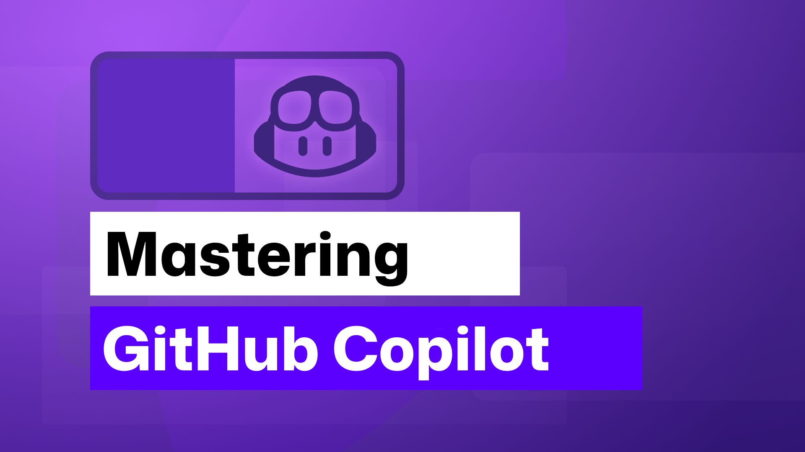

# Mastering GitHub Copilot for Peer Programming
This multi-module course teaching everything you need to know about harnessing GitHub Copilot as an AI Peer Programming resource.

Unlock the power of collaborative coding with our comprehensive curriculum on Mastering GitHub Copilot for Peer Programming. This cutting-edge program seamlessly integrates AI-driven coding assistance through GitHub Copilot, empowering students to accelerate their coding skills in tandem with a partner. Over the course of 10 engaging hours, participants will navigate through essential setup procedures, leveraging Visual Studio Code and GitHub Copilot Chat for real-time collaboration. Dive deep into GitHub Copilot's autocompletion, customizable features, and advanced programming techniques, all while embracing AI-driven algorithms. From error handling to unit testing, this curriculum is tailored to instill best practices and enhance code quality. Immerse yourself in a transformative learning experience that fuses the latest AI technology with Peer programming strategies, equipping you with the tools needed for success in today's dynamic software development landscape.

## 🌱 Getting Started

To get started, make sure to follow the instructions on how to fork the lessons into your own GitHub account. This will allow you to modify the code and complete the challenges at your own pace.

To use GitHub Copilot, you must have an active GitHub Copilot subscription.

**Sign up for free here: [GitHub Copilot](https://gh.io/copilot).**

To make it easier to revisit this repository in the future, you can also [star (🌟) this repo](https://docs.github.com/en/get-started/exploring-projects-on-github/saving-repositories-with-stars?WT.mc_id=academic-113596-abartolo) this repo.

Below are links to each lesson—feel free to explore and dive into any topic that interests you the most!

## 🧠 Want to learn more?
After completing this course, check out our [GitHub Copilot Learn Collection](https://learn.microsoft.com/collections/kkqrhmxoqn54?WT.mc_id=academic-113596-abartolo) to continue leveling up your AI Peer Programming knowledge!

##  🚀  Are you a startup or got an idea you want to launch?

Sign up for [Microsoft for Startups Founders Hub](https://foundershub.startups.microsoft.com/signup?WT.mc_id=academic-113596-abartolo) to receive **free OpenAI credits** and up to **$150k towards Azure credits to access OpenAI models through Azure OpenAI Services**.

##  🙏 Want to help?

Here are ways you can contribute to this course:
- Find spelling errors or code errors, [Raise an issue](https://github.com/microsoft/Mastering-GitHub-Copilot-for-Peer-Programming/issues/new/choose) or [Create a pull request](https://github.com/microsoft/Mastering-GitHub-Copilot-for-Peer-Programming/pulls)
- Send us your ideas, maybe your ideas for new lessons or exercises, and let us know how we can improve.

## 📂 Each lesson includes:

- a written lesson located in the README
- a challenge or assignment to apply your learning
- links to extra resources to continue your learning

## 🗃️ Lessons

# Beginner 
|              Lesson Link              |                       Concepts Taught                       |                     Learning Goal                 |
| :------------------------------------: | :---------------------------------------------------------: | ----------------------------------------------------------- |
| [Getting Started with GitHub Copilot](./Getting-Started-with-GitHub-Copilot) | GitHub Copilot is an AI coding assistant that can help you write code faster and with less effort, allowing you to focus more energy on problem solving and collaboration. |  In this exercise, you'll unlock the potential of this AI-powered coding assistant to accelerate your development process. |

# Intermediate 
|              Lesson Link              |                       Concepts Taught                       |                     Learning Goal                 |
| :------------------------------------: | :---------------------------------------------------------: | ----------------------------------------------------------- |
| [Using GitHub Copilot with JavaScript](./Using-GitHub-Copilot-with-JavaScript) | Use GitHub Copilot, an AI pair programmer that offers autocomplete-style suggestions as you code, to work with JavaScript. | Enable the GitHub Copilot extension in Visual Studio Code. Craft prompts that can generate useful suggestions from GitHub Copilot. Use GitHub Copilot to improve a JavaScript project. |
| [Using GitHub Copilot with Python](./Using-GitHub-Copilot-with-Python) | Use GitHub Copilot, an AI pair programmer that offers autocomplete-style suggestions as you code, to work with Python. | Enable the GitHub Copilot extension in Visual Studio Code. Craft prompts that can generate useful suggestions from GitHub Copilot. Use GitHub Copilot to improve a Python project. |
| [Using GitHub Copilot with C#](./Using-GitHub-Copilot-with-CSharp) | Use GitHub Copilot, an AI pair programmer that offers autocomplete-style suggestions as you code, to work with C#. | Enable the GitHub Copilot extension in Visual Studio Code. Craft prompts that can generate useful suggestions from GitHub Copilot. Use GitHub Copilot to improve a C# Minimal API project. |
| [Creating a Mini Game with GitHub Copilot](./Creating-Mini-Game-with-GitHub-Copilot) | Use GitHub Copilot to assist you in building a Python-based mini game. | Craft prompts that can generate useful suggestions from GitHub Copilot to incorporate gaming logic and improve your Python-based game. |

# Advanced 
|              Lesson Link              |                       Concepts Taught                       |                     Learning Goal                 |
| :------------------------------------: | :---------------------------------------------------------: | ----------------------------------------------------------- |
| [Using Advanced GitHub Copilot Features](./Using-Advanced-GitHub-Copilot-Features) | Use advanced GitHub Copilot features like inline chat, slash commands, and agents. | Interact with GitHub Copilot with deeper context on your project and ask questions about it. |
| [Getting Started with Copilot for Azure to Deploy to the Cloud](./Using-GitHub-Copilot-for-Azure-to-Deploy-to-Cloud) | Learn cloud deployment with GitHub Copilot for Azure—your ultimate guide to streamlined cloud success. | Effortless application deployment leveraging Azure’s powerful scalability. |
| [**NEW** Challenging GitHub Copilot with complex SQL](./Challenging-GitHub-Copilot-with-SQL) | Apply advanced GitHub Copilot features to work with a challenging application working with a complex SQL query | Gain a clear understanding of how to work with extremely challenging SQL and yield better results when simple prompts don't work well |
| [**NEW** Upgrading Legacy project](./Upgrading-Legacy-Projects) | Leverage GitHub Copilot to upgrade a legacy Python project to the latest version of Python. | Apply techniques to overcome the challenges involved in working with legacy projects |
| [**NEW** Migrating to a new language](./Migrating-Languages) | Rewrite an existing application using a different language with the guidance of GitHub Copilot | Use advanced workflows with GitHub Copilot applicable when translating projects to different programming languages |

## 🎒  Other Courses

Our team produces other courses! Check out:

- [**NEW** Model Context Protocol for Beginners](https://github.com/microsoft/mcp-for-beginners)
- [AI Agents for Beginners](https://github.com/microsoft/ai-agents-for-beginners)
- [Generative AI for Beginners using .NET](https://github.com/microsoft/Generative-AI-for-beginners-dotnet)
- [Generative AI for Beginners using JavaScript](https://aka.ms/genai-js-course)
- [ML for Beginners](https://aka.ms/ml-beginners)
- [Data Science for Beginners](https://aka.ms/datascience-beginners)
- [AI for Beginners](https://aka.ms/ai-beginners)
- [Cybersecurity for Beginners](https://github.com/microsoft/Security-101)
- [Web Dev for Beginners](https://aka.ms/webdev-beginners)
- [IoT for Beginners](https://aka.ms/iot-beginners)
- [XR Development for Beginners](https://github.com/microsoft/xr-development-for-beginners)
- [Mastering GitHub Copilot for AI Peer Programming](https://aka.ms/GitHubCopilotAI)
- [Mastering GitHub Copilot for C#/.NET Developers](https://github.com/microsoft/mastering-github-copilot-for-dotnet-csharp-developers)
- [Choose Your Own Copilot Adventure](https://github.com/microsoft/CopilotAdventures)
