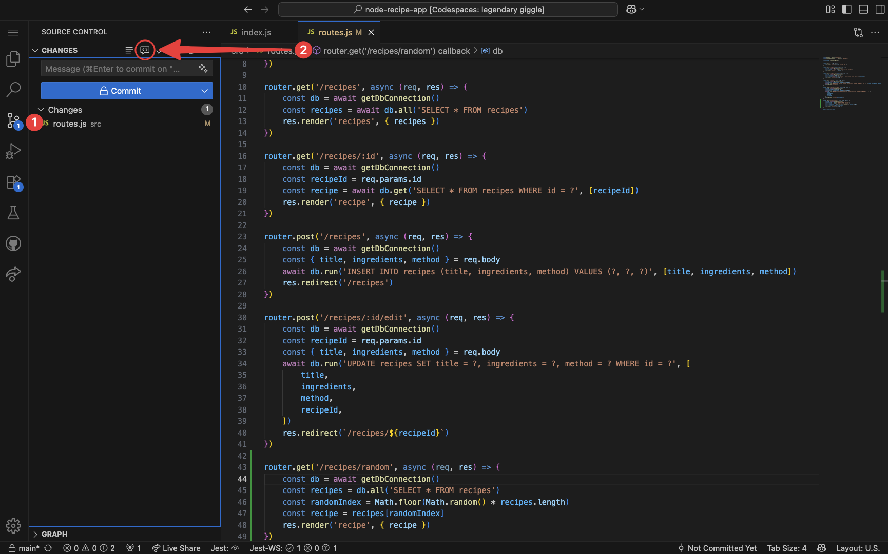
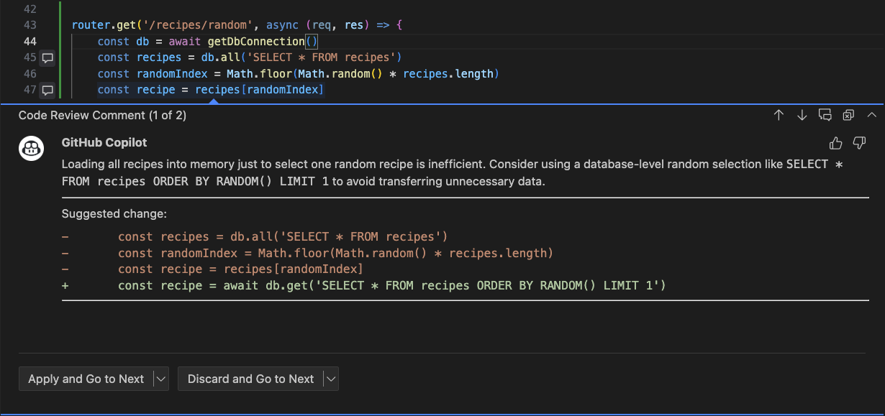

<header>

# Using Advanced GitHub Copilot Features

In this module, you'll learn how to leverage GitHub Copilot's advanced capabilities to provide automated code reviews and generate complex code autonomously and asynchronously.

This module will be updated periodically to include new general availability features and improvements. Currently, this module can be completed in about 20 minutes.

</header>

By the end of this module, you’ll be able to:

- Assign GitHub Copilot as a reviewer for fast feedback on your code changes.

## 📖 Prerequisite reading

- [Introduction to prompt engineering with GitHub Copilot](https://learn.microsoft.com/training/modules/introduction-prompt-engineering-with-github-copilot//?WT.mc_id=academic-113596-abartolo)
- [Using GitHub Copilot with JavaScript](https://learn.microsoft.com/training/modules/introduction-copilot-javascript/?WT.mc_id=academic-113596-abartolo)

## 📋 Requirements

1. Enable your [GitHub Copilot service](https://github.com/github-copilot/signup)
1. Open [this repository with Codespaces](https://codespaces.new/github-samples/node-recipe-app?quickstart=1)

**Right click the following Codespaces button to open your Codespace in a new tab**

[](https://codespaces.new/github-samples/node-recipe-app?quickstart=1)

_Note: if you have an existing Codespace with this project, please create a new one for this module._

This application is a recipe app that allows users to create, edit, and read recipes. By default, there are notable missing features including the ability to delete and search recipes.

## 🧑‍💻 Section 1: Copilot Code Review

**🎯 Learning Goals**

- Be able to trigger code reviews in your code editor.
- Request code reviews on GitHub.com.

Once your Codespace launches, you'll have a fully functional development environment with the entire repository preloaded.

Open the `src/routes.js` file. Just above the final line where the router is exported, add the following code:

```js
router.get('/recipes/random', async (req, res) => {
	const db = await getDbConnection()
	const recipes = db.all('SELECT * FROM recipes')
	const randomIndex = Math.floor(Math.random() * recipes.length)
	const recipe = recipes[randomIndex]
	res.render('recipe', { recipe })
})
```

_Note: this code has at least one logic bug and at least one area where it is inefficient. That's ok! Copilot should help us identify these improvements._

Open your source control sidebar and then request a code review from Copilot in your IDE. After a few seconds, Copilot will create inline comments, if any, in your editor.



You can choose to apply the suggested change directly, or discard it if preferred. In this case, Copilot has 2 different comments for this piece of code — applying or discarding will load the second comment. You can also toggle between them using the arrow icons in the top-right of the comment box.



Remember, Copilot is nondeterministic so you may have different suggestions. Apply all changes and commit your work.

### Copilot Code Review on web and mobile

Copilot can also be assigned as a reviewer for pull requests on the GitHub website and via the GitHub mobile app. This allows you to get feedback on your code changes from Copilot directly in the context of your pull request. This feature requires a [paid license for GitHub Copilot](https://github.com/features/copilot#pricing).

## 📖 Discover more

GitHub Copilot is constantly evolving with new features and improvements. To stay updated on the latest developments, check out the [GitHub Changelog](https://github.blog/changelog/?label=copilot). This module will be updated as new features enter general availability.
