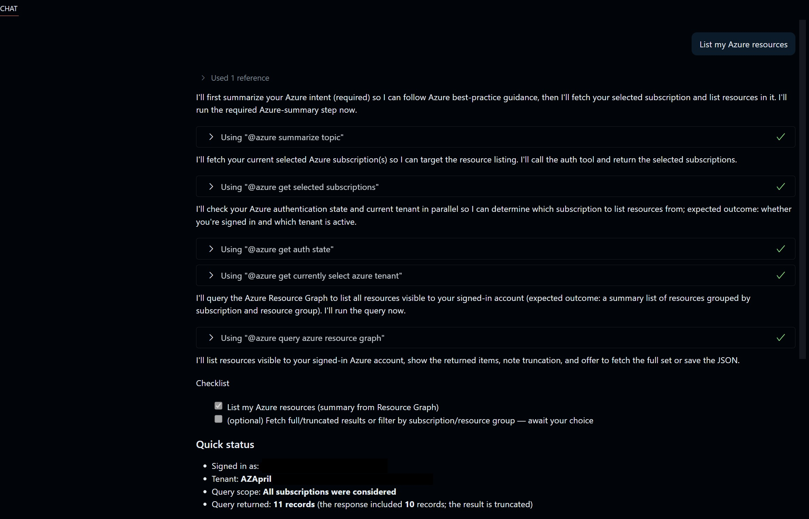

# Getting Started with Copilot for Azure to Deploy to the Cloud

Managing and deploying cloud resources have historically required developers to switch between various interfaces — integrated development environments (IDEs), command-line tools, Azure Portal dashboards, and third-party CI/CD solutions. This context switching interrupts workflows, multiplies sources of truth, and slows down delivery. With the rise of AI-powered developer tools, a new paradigm is emerging: agentic, autonomous AI collaborators that reside within the IDE, orchestrate across cloud and DevOps environments, and allow developers to command the cloud as simply as they manipulate code.

This detailed hands-on workshop will guide developers through harnessing GitHub Copilot Agent Mode in GitHub Codespaces (also available to run in VSCode), integrated with the Azure Model Context Protocol (MCP) server. By the end of this session, you'll be able to set up GitHub Copilot's Coding Agent, connect it to the Azure MCP server for secure, natural language-driven management of cloud infrastructure, and seamlessly complete tasks such as provisioning resources, retrieving secrets, diagnosing issues, and deploying applications from your IDE—directly on top of an existing database API codebase.

This workshop emphasizes how Copilot Agent Mode plus Azure MCP together alleviate pain points like context switching and fragmented workflows, providing developers with a unified, rapid, and secure cloud experience


- **Who is this for**: Developers, DevOps Engineers and Operations (ITPros)
- **What you'll learn**: Gain a comprehensive understanding of GitHub Copilot for Azure through three key phases: learning, deployment, and troubleshooting.
- **What you'll build**: Confidently create, deploy, and maintain robust, scalable applications—powered by AI and optimized for the cloud.

By the end of this workshop, you will:

- Master foundational concepts and best practices of GitHub Copilot for Azure utilization.
- Implement applications on Azure with seamless integration and scalability.
- Use advanced tools to diagnose and resolve issues, ensuring reliable performance.

## Prerequisite reading:
- [What is GitHub Copilot for Azure?](https://learn.microsoft.com/azure/developer/github-copilot-azure/introduction)

- [What is the Azure MCP Server?](https://learn.microsoft.com/azure/developer/azure-mcp-server/overview)

## Requirements
  
1. [GitHub Account](https://docs.github.com/get-started/start-your-journey/creating-an-account-on-github)

2. [GitHub Copilot Chat extension](https://marketplace.visualstudio.com/items?itemName=GitHub.copilot): GitHub Copilot is an AI pair programmer tool that helps you write code faster and smarter.
   
3. [GitHub Copilot for Azure](https://marketplace.visualstudio.com/items?itemName=ms-azuretools.vscode-azure-github-copilot): GitHub Copilot for Azure is the @azure extension. It’s designed to help streamline the process of developing for Azure. You can ask @azure questions about Azure services or get help with tasks related to Azure and developing for Azure, all from within Visual Studio Code.
   
4. [Microsoft Azure Account](https://azure.microsoft.com/pricing/purchase-options/azure-account): Start building, deploying, and managing applications seamlessly across the cloud, on-premises, and edge environments with Azure's scalable and cost-efficient services. Try Azure free for up to 30 days with no upfront commitment—cancel anytime.

5. [Azure MCP Server Extension](https://marketplace.visualstudio.com/items?itemName=ms-azuretools.vscode-azure-mcp-server)

## 💪🏽 Exercise

**Right click the following Codespaces button to open your Codespace in a new tab**

[](https://codespaces.new/Azure-Samples/msdocs-python-flask-webapp-quickstart)

This hands-on workshop guides you through setting up and using GitHub Copilot Agent Mode in Visual Studio Code, integrated with the Azure MCP server, to streamline cloud resource management and deployment workflows. Participants will start with a prebuilt database API demo and learn how to interact with the Copilot Coding Agent directly from their IDE—assigning cloud-related tasks, provisioning infrastructure, retrieving secrets, diagnosing issues, and deploying applications—all without switching to the Azure Portal or CLI. 

### 🗒️ Section 1: Exploring & Configuring Your Project

🎯**Learning Goals**
- Set up the GitHub Copilot Coding Agent and the GitHub Copilot for Azure extensions
- Understand Agent Mode 
- Connect to your Azure subscription

In this first section we are going to setup our environment and get started with GitHub Copilot for Azure, understanding the capabilities and features available to us.

Let's get started!

1. Click the Copilot Chat icon in the top-right corner of the Codespace window:

<div align="left">

</div>

2. This is GitHub Copilot Chat and agent mode should be displayed by default in the bottom left corner. Notice in the text box you can 'add context', which allows you to attach files, folders and other items to the context of Copilot so that it can better understand your codebase. You have the capability to choose your model as well. 

<div align="left">

</div>

3. If you have not already done so, install the [GitHub Copilot for Azure extension in the marketplace](https://marketplace.visualstudio.com/items?itemName=ms-azuretools.vscode-azure-github-copilot). 

**Note:**You will need to authenticate to your Azure subscription. You should be prompted when it's installed. If not, when you go to the next step, you will receive a prompt.

4. In the Copilot Chat window type in `@Azure` and look at the list available. You will notice a list of slash commands that you can also execute to quickly ask questions to Copilot. Take this time to play around with some of the commands. In the example below, Azure was queried as tools for available in the extension.

<div align="left">

</div>

5. After you have had some time to explore the responses from Copilot, select the tool icon in the chat pane. It opens up the extension tools, look around at the tools available that you can enable and disable. 

<div align="left">

</div>

In the above exercises we achieved the following: 
- ✅ Configured Copilot Chat and installed the GitHuc Copilot for Azure extension
- ✅ Query the `@Azure` extension and explore features and tools

Now that we have had a tour and configured our environment, we're going to add context and configure the Azure MCP Server.

### 🗒️ Section 2: Configuring the Azure MCP Server and Using Agent Mode

🎯**Learning Goals**
- Set up the Azure MCP Server
- Deploy an application to Azure using Agent Mode

The Azure MCP Server is an open implementation of the Model Context Protocol—a standardized interface for exposing external tools, data sources, and actions to AI agents, such as Copilot in Agent Mode. It functions as a middle layer between the agent (client) and your Azure environment, enabling secure, context-aware natural language management of cloud resources.

Key Points:
- Supports broad Azure services: App Configuration, Key Vault, Storage, Cosmos DB, SQL, Kubernetes, Azure Developer CLI (azd), Azure CLI, etc.
- Authentication: Uses Azure authentication flow, inheriting RBAC and user scopes
- Command/Tool Abstraction: Each Azure resource operation is exposed as a discrete tool, discoverable and invocable by Copilot for queries and actions
- Security: Enforces permissions, supports HTTPS, can be bound to Entra ID, follows least privilege principles

Now we are going to build a simple Python application in Azure using Flask. 

1. The Azure MCP Server extension should have installed with the GitHub Copilot for Azure extension. The Azure MCP Server should start by default. To test this out, in the chat pane type: `List my Azure resources`

<div align="left">

</div>

**Note:** If the MCP server has not been start, you can configure it to do so by opening `settings` in VSCode (or your Codespace) search for `chat.mcp.autostart` and select `newAndOutdated` to automatically start the extension. 

2. Once we've confirmed that the MCP server is running, let's build a simple web app and deploy it to Azure. First, create a branch to work from. As we're using Agent mode, we can give Copilot a list of requirements to fully deploy our app. We can tell Copilot exactly what we want to deploy. Give Agent mode a detailed prompt. Copy and paste the prompt below into the chat window:

```
There is a Python web app in this repo. Please help me build and deploy it to Azure. 
- Use Azure App Service for hosting. 
- Create a new resource group with the name `RG-flaskapp`
- Set up any required Azure resources (App Service Plan basic, Storage, etc.). Use the naming convention of `flaskapp` 
- Configure environment variables from my `.env` file as application settings. 
- Build the app and deploy it. 
- Finally, return the deployed app’s public URL.
```

Copilot will work through the prompt. It will look to understand what was asked, and in the example below, it referenced Azure best practices to help itself better execute the request. 

In using Agent mode and the Azure MCP Server, Copilot was able to achieve: 

**Build and Deploy Code:**
- Python environment setup
- Installation of application dependencies
- Authentication to Azure using service principal credentials
- Deployment to Azure Web App using the azure/webapps-deploy action

**Azure Resources Deployed:**
- Resource Group: RG-flaskapp
- App Service Plan (Basic tier)
- App Service named flaskapp
- Environment variables configured as App Settings

**Security and Authentication:**
- Requires AZURE_CREDENTIALS secret in GitHub repository
- Uses service principal authentication to Azure
- Deployment happens in a 'Production' environment with URL tracking

3. Next, let’s take it a step further by asking Copilot to create a workflow file for us. This will set up CI/CD (Continuous Integration and Delivery) to Azure, with testing and deployment tracking built in — making our deployments smoother and more reliable. In the chat window, type or copy in: `Write a GitHub Actions workflow to deploy my python app to Azure, include testing for CI/CD`
 
 Copilot provided the following workflow, review and accept the changes (or prompt Copilot to remediate if needed): 

 ```YAML
 name: Python Flask CI/CD

on:
  push:
    branches: [ "main" ]
  pull_request:
    branches: [ "main" ]
  workflow_dispatch:

env:
  AZURE_WEBAPP_NAME: flaskapp
  PYTHON_VERSION: '3.10'

jobs:
  test:
    runs-on: ubuntu-latest
    steps:
    - uses: actions/checkout@v3

    - name: Set up Python
      uses: actions/setup-python@v4
      with:
        python-version: ${{ env.PYTHON_VERSION }}
        
    - name: Install dependencies
      run: |
        python -m pip install --upgrade pip
        pip install -r requirements.txt
        pip install pytest pytest-cov

    - name: Run tests with pytest
      run: |
        pytest --cov=./ --cov-report=xml

    - name: Upload coverage reports to Codecov
      uses: codecov/codecov-action@v3
      with:
        file: ./coverage.xml
        flags: unittests

  build-and-deploy:
    needs: test
    runs-on: ubuntu-latest
    environment:
      name: 'Production'
      url: ${{ steps.deploy-to-webapp.outputs.webapp-url }}

    steps:
    - uses: actions/checkout@v3

    - name: Set up Python
      uses: actions/setup-python@v4
      with:
        python-version: ${{ env.PYTHON_VERSION }}

    - name: Install dependencies
      run: |
        python -m pip install --upgrade pip
        pip install -r requirements.txt

    - name: Log in to Azure
      uses: azure/login@v1
      with:
        creds: ${{ secrets.AZURE_CREDENTIALS }}

    - name: Deploy to Azure Web App
      id: deploy-to-webapp
      uses: azure/webapps-deploy@v2
      with:
        app-name: ${{ env.AZURE_WEBAPP_NAME }}
        package: .
```

This workflow file includes the following capabilities: 

- Testing job: Runs on every push and pull request to main branch, sets up Python 3.10, installs dependencies and testing tools, runs pytest with coverage reporting, uploads coverage reports to Codecov
  
- Build and Deploy job: Only runs after tests pass, sets up Python environment, installs dependencies, logs into Azure using credentials, deploys to Azure Web App

4. There is a multitude of tasks that you can complete with Copilot. Here are some sample ideas below:

- Connect a database to your app using PostgreSQL
- add a user sign-in to your Python web app
- Run your Python app in a container
- Add monitoring by enabling Application Insights
- Secure secrets by storing connecting strings in Azure Key Vault
- Query Azure to perform a cloud cost optimization, find and remove unused resources in your subscription, or query Copilot for estimated costs of provisioned resources
- Ask Copilot to run through security best practices for the applications' Azure setup
- Create an architecture diagram from the deployment

🚀Congratulations! You’ve just leveled up by using GitHub Copilot with Azure MCP to code, deploy, and manage cloud resources — all without leaving your IDE

In the above exercises we achieved the following: 
- ✅ Enabling Azure MCP Server
- ✅ Using Agent Mode to clearly define tasks
- ✅ Creating a CI/CD workflow, including tests
- ✅ Reviewing advanced use cases for using GitHub Copilot Chat with the Azure MCP Server

[Check out the other learning pathways in this repository.](### Useful Links and Further Learning)


### Useful Links and Further Learning

- [Blog: Introducing GitHub Copilot for Azure: Your Cloud Coding Companion in VS Code!](https://techcommunity.microsoft.com/t5/microsoft-developer-community/introducing-github-copilot-for-azure-your-cloud-coding-companion/ba-p/4127644)
- [Blog: GitHub Copilot for Azure: 6 Must-Try Features](https://techcommunity.microsoft.com/t5/microsoft-developer-community/github-copilot-for-azure-6-must-try-features/ba-p/4283126)
- [Video: GitHub Copilot for Azure: 6 Must-Try Features](https://youtube.com/playlist?list=PLlrxD0HtieHgdwrN6ooxApdfBKTJK7465&si=9rl-kNItvFPeqhwa)
- [Video: Build intelligent apps with Visual Studio Code, GitHub, and Azure](https://youtu.be/30OpmbWL1t8?si=FvkRqa-wxTHaU3qA&t=1024)

## Legal Notices

Microsoft and any contributors grant you a license to the Microsoft documentation and other content
in this repository under the [Creative Commons Attribution 4.0 International Public License](https://creativecommons.org/licenses/by/4.0/legalcode),
see the [LICENSE](LICENSE) file, and grant you a license to any code in the repository under the [MIT License](https://opensource.org/licenses/MIT), see the
[LICENSE-CODE](LICENSE-CODE) file.

Microsoft, Windows, Microsoft Azure and/or other Microsoft products and services referenced in the documentation
may be either trademarks or registered trademarks of Microsoft in the United States and/or other countries.
The licenses for this project do not grant you rights to use any Microsoft names, logos, or trademarks.
Microsoft's general trademark guidelines can be found at http://go.microsoft.com/fwlink/?LinkID=254653.

Privacy information can be found at https://privacy.microsoft.com/en-us/

Microsoft and any contributors reserve all other rights, whether under their respective copyrights, patents,
or trademarks, whether by implication, estoppel or otherwise.
