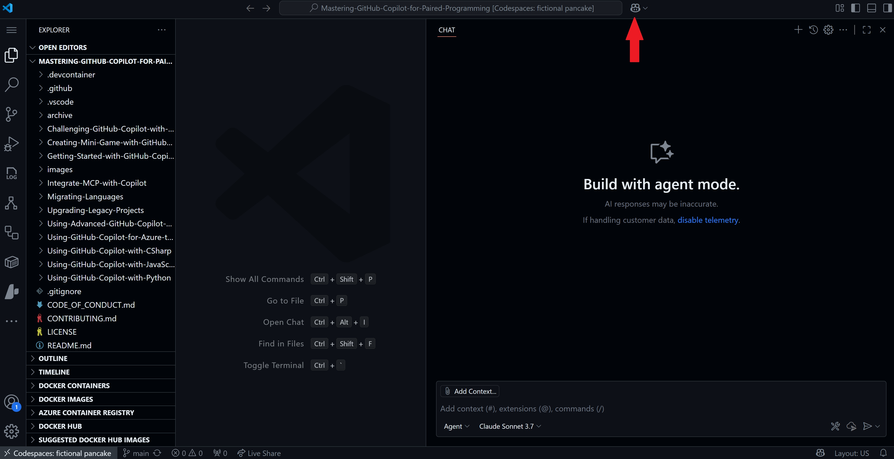
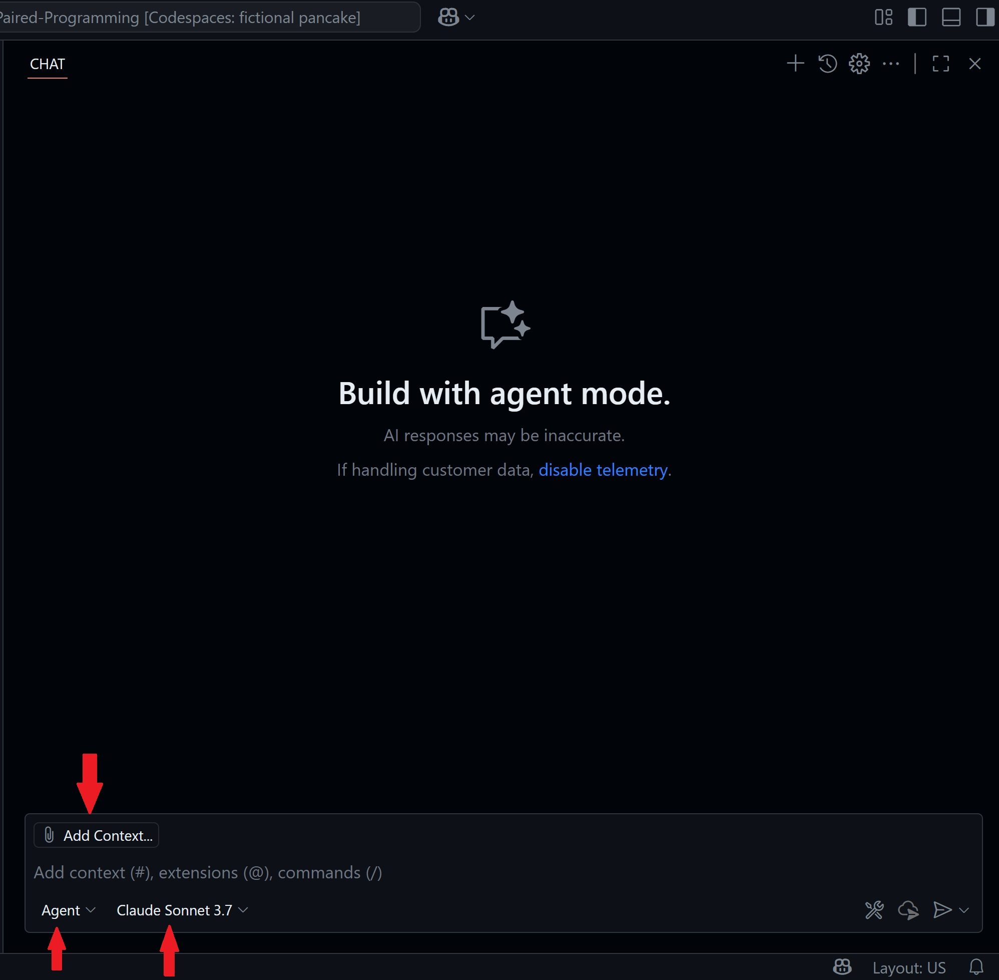
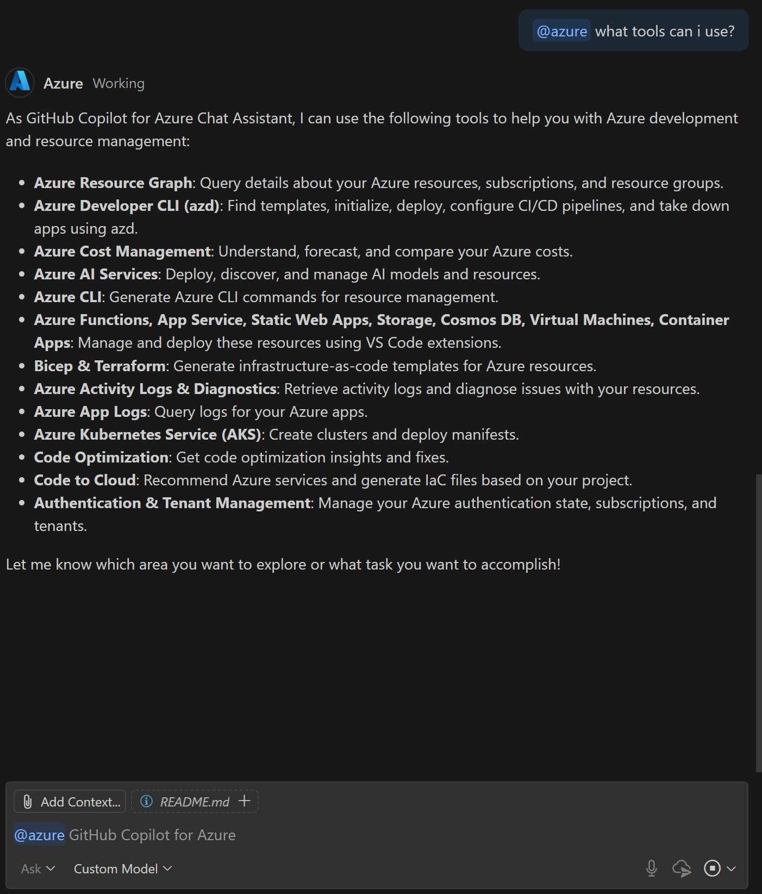

# Getting Started with Copilot for Azure to Deploy to the Cloud

Managing and deploying cloud resources have historically required developers to switch between various interfaces — integrated development environments (IDEs), command-line tools, Azure Portal dashboards, and third-party CI/CD solutions. This context switching interrupts workflows, multiplies sources of truth, and slows down delivery. With the rise of AI-powered developer tools, a new paradigm is emerging: agentic, autonomous AI collaborators that reside within the IDE, orchestrate across cloud and DevOps environments, and allow developers to command the cloud as simply as they manipulate code.

This detailed hands-on workshop will guide developers through harnessing GitHub Copilot Agent Mode in Visual Studio Code (VS Code), integrated with the Azure Model Context Protocol (MCP) server. By the end of this session, you'll be able to set up GitHub Copilot's Coding Agent, connect it to the Azure MCP server for secure, natural language-driven management of cloud infrastructure, and seamlessly complete tasks such as provisioning resources, retrieving secrets, diagnosing issues, and deploying applications from your IDE—directly on top of an existing database API codebase.

This workshop emphasizes how Copilot Agent Mode plus Azure MCP together alleviate pain points like context switching and fragmented workflows, providing developers with a unified, rapid, and secure cloud experience

- **Who is this for**: Developers, DevOps Engineers and Operations (ITPros)
- **What you'll learn**: Gain a comprehensive understanding of GitHub Copilot for Azure through three key phases: learning, deployment, and troubleshooting.
- **What you'll build**: Confidently create, deploy, and maintain robust, scalable applications—powered by AI and optimized for the cloud.

By the end of this workshop, you will:

- Master foundational concepts and best practices of GitHub Copilot for Azure utilization.
- Implement applications on Azure with seamless integration and scalability.
- Use advanced tools to diagnose and resolve issues, ensuring reliable performance.

## Prerequisite reading:
- [What is GitHub Copilot for Azure?](https://learn.microsoft.com/azure/developer/github-copilot-azure/introduction)

- [What is the Azure MCP Server?](https://learn.microsoft.com/azure/developer/azure-mcp-server/overview)

## Requirements
  
1. [GitHub Account](https://docs.github.com/get-started/start-your-journey/creating-an-account-on-github)

2. [GitHub Copilot Chat extension](https://marketplace.visualstudio.com/items?itemName=GitHub.copilot): GitHub Copilot is an AI pair programmer tool that helps you write code faster and smarter.
   
3. [GitHub Copilot for Azure](https://marketplace.visualstudio.com/items?itemName=ms-azuretools.vscode-azure-github-copilot): GitHub Copilot for Azure is the @azure extension. It’s designed to help streamline the process of developing for Azure. You can ask @azure questions about Azure services or get help with tasks related to Azure and developing for Azure, all from within Visual Studio Code.
   
4. [Microsoft Azure Account](https://azure.microsoft.com/pricing/purchase-options/azure-account): Start building, deploying, and managing applications seamlessly across the cloud, on-premises, and edge environments with Azure's scalable and cost-efficient services. Try Azure free for up to 30 days with no upfront commitment—cancel anytime.

5. [Azure MCP Server Extension](https://marketplace.visualstudio.com/items?itemName=ms-azuretools.vscode-azure-mcp-server)

## 💪🏽 Exercise

**Right click the following Codespaces button to open your Codespace in a new tab**

This hands-on workshop guides you through setting up and using GitHub Copilot Agent Mode in Visual Studio Code, integrated with the Azure MCP server, to streamline cloud resource management and deployment workflows. Participants will start with a prebuilt database API demo and learn how to interact with the Copilot Coding Agent directly from their IDE—assigning cloud-related tasks, provisioning infrastructure, retrieving secrets, diagnosing issues, and deploying applications—all without switching to the Azure Portal or CLI. 

### 🗒️ Section 1: Exploring & Configuring Your Project

🎯**Learning Goals**
- Set up the GitHub Copilot Coding Agent and the GitHub Copilot for Azure extensions
- Understand Agent Mode 
- Connect to your Azure subscription

In this first section we are going to setup our environment and get started with GitHub Copilot for Azure, understanding the capabilities and features available to us.

Let's get started!

1. Click the Copilot Chat icon in the top-right corner of the Codespace window:

2. This is GitHub Copilot Chat and agent mode should be displayed by default in the bottom left corner. Notice in the text box you can 'add context', which allows you to attach files, folders and other items to the context of Copilot so that it can better understand your codebase. You have the capability to choose your model as well. 

3. If you have not already done so, install the [GitHub Copilot for Azure extension in the marketplace](https://marketplace.visualstudio.com/items?itemName=ms-azuretools.vscode-azure-github-copilot). 

**Note:**You will need to authenticate to your Azure subscription. You should be prompted when it's installed. If not, when you go to the next step, you will receive a prompt.

4. In the Copilot Chat window type in `@Azure` and look at the list available. You will notice a list of slash commands that you can also execute to quickly ask questions to Copilot. Take this time to play around with some of the commands. In the example below, Azure was queried as tools for available in the extension.

5. After you have had some time to explore the responses from Copilot, select the tool icon in the chat pane. It opens up the extension tools, look around at the tools available that you can enable and disable. 

Now that we have had a tour and configured our environment, we're going to add context and configure the Azure MCP Server.

### Section 2: MCP

🎯**Learning Goals**
- Set up the GitHub Copilot Coding Agent and the GitHub Copilot for Azure extensions
- Understand Agent Mode 
- Connect to your Azure subscription

The Azure MCP Server is an open implementation of the Model Context Protocol—a standardized interface for exposing external tools, data sources, and actions to AI agents, such as Copilot in Agent Mode. It functions as a middle layer between the agent (client) and your Azure environment, enabling secure, context-aware natural language management of cloud resources.

Key Points:
- Supports broad Azure services: App Configuration, Key Vault, Storage, Cosmos DB, SQL, Kubernetes, Azure Developer CLI (azd), Azure CLI, etc.
- Available as a VS Code Extension or via direct workspace config (see practical setup below)
- Authentication: Uses Azure authentication flow, inheriting RBAC and user scopes
- Command/Tool Abstraction: Each Azure resource operation is exposed as a discrete tool, discoverable and invocable by Copilot for queries and actions
- Security: Enforces permissions, supports HTTPS, can be bound to Entra ID, follows least privilege principles

- [Blog: Introducing GitHub Copilot for Azure: Your Cloud Coding Companion in VS Code!](https://techcommunity.microsoft.com/t5/microsoft-developer-community/introducing-github-copilot-for-azure-your-cloud-coding-companion/ba-p/4127644)
- [Blog: GitHub Copilot for Azure: 6 Must-Try Features](https://techcommunity.microsoft.com/t5/microsoft-developer-community/github-copilot-for-azure-6-must-try-features/ba-p/4283126)
- [Video: GitHub Copilot for Azure: 6 Must-Try Features](https://youtube.com/playlist?list=PLlrxD0HtieHgdwrN6ooxApdfBKTJK7465&si=9rl-kNItvFPeqhwa)
- [Video: Build intelligent apps with Visual Studio Code, GitHub, and Azure](https://youtu.be/30OpmbWL1t8?si=FvkRqa-wxTHaU3qA&t=1024)
