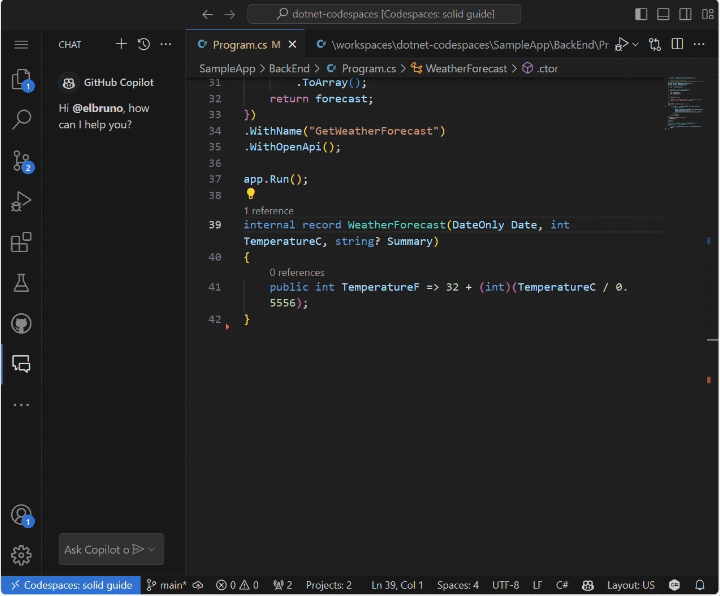
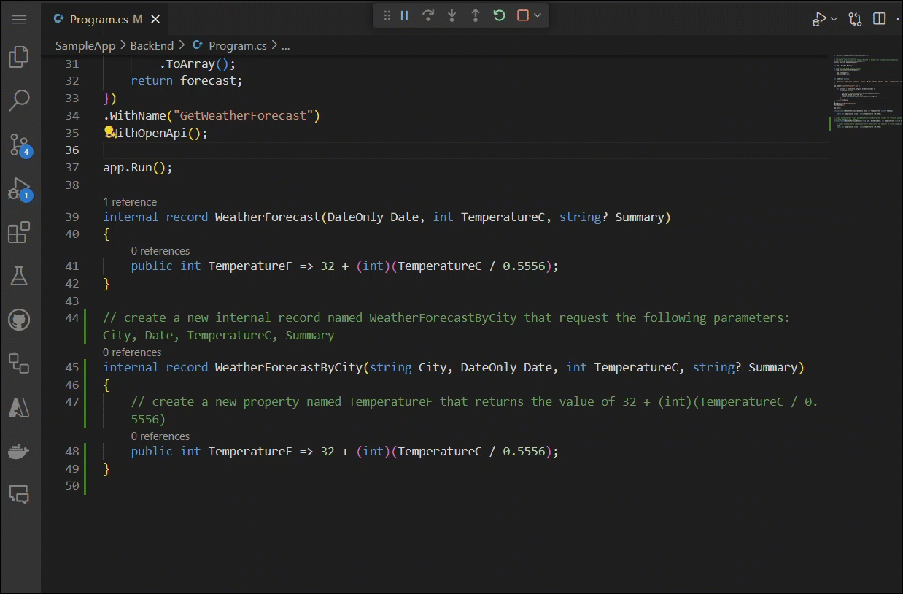

<header>

# Using GitHub Copilot with C#

Welcome to a hands-on, multi-module course that transforms GitHub Copilot from a simple autocomplete tool into your proactive AI pair programmer. Whether you’re new to AI-assisted coding or looking to deepen your expertise, in this module you will learn how to leverage Copilot's features and enhance your efficiency when coding in C#. You will gain a clear understanding of Copilot's core capabilities and how they fit into modern C# workflows. This is a hands-on experience with getting to understand inline suggestions, natural-language prompting and context-aware code suggestions. 

Prepare to tackle a practical, hands-on project! You’ll work on modifying a C# repository to create an API endpoint using GitHub Copilot. This exercise will provide valuable experience in building a C# web application that serves an HTTP API and generates pseudo-random weather forecast data.

</header>


- **Who this is for**: Developers, DevOps Engineers, Software Development Managers, Testers.
- **What you'll learn**: How to use GitHub Copilot to for code completion, inline suggestions and next edit suggestions, as well as adding comments to your work.
- **What you'll build**: C# files that will have code generated by Copilot AI for code and comment suggestions.
- **Prerequisites**: GitHub Copilot is available to use for free, sign up for [GitHub Copilot](https://gh.io/copilot).
- **Timing**: This course can be completed in under an hour.

By the end of this module, you'll acquire the skills to be able to:

- Engage with Copilot in the IDE using inline suggestions and next-edit completions. 
- Craft prompts to generate suggestions from GitHub Copilot using code completion and chat.
- Apply GitHub Copilot to improve your projects.

## Prerequisite reading:
- [Introduction to prompt engineering with GitHub Copilot](https://learn.microsoft.com/training/modules/introduction-prompt-engineering-with-github-copilot?WT.mc_id=academic-113596-abartolo)

- [What is the GitHub Copilot extension for Visual Studio?](https://learn.microsoft.com/visualstudio/ide/visual-studio-github-copilot-extension?view=vs-2022&WT.mc_id=academic-113596-abartolo)

## Requirements

1. Enable your [GitHub Copilot service](https://github.com/github-copilot/signup)

1. Get familiar with [this repository with Codespaces](https://github.com/github/dotnet-codespaces)

## 💪🏽 Exercise

**Right click the following Codespaces button to open your Codespace in a new tab**
 
[](https://codespaces.new/github/dotnet-codespaces)

The "**GitHub Codespaces ♥️ .NET 8**" repository builds a Weather API using Minimal APIs, opens Swagger so you can call and test the API, and displays the data in a web application using Blazor with .NET 8.

We will review the steps to update the Weather BackEnd App by adding a new endpoint that requests a specific location and returns the weather forecast for that location.


### 🗒️ Section 1: Code Completion 

🎯**Learning Goals**
- Use inline code completion to scaffold new classes and methods
- Trigger and refine Copilot completions
- Use inline chat and slash commands

Once your Codespace launches, you'll have a fully functional development environment with the entire repository preloaded. This is the perfect time to explore GitHub Copilot Chat to help you better understand the codebase.

To get started:

1. Click the Copilot Chat icon in the top-right corner of the Codespace window


2. Instead of manually exploring the BackEnd and Front folders, try asking Copilot for an overview. In the chat pane, type '/' to view available slash commands — these offer quick, structured ways to interact with Copilot.
Type '/help' to see all commands, or check out the {GitHub Copilot Chat cheat sheet for  a list of slash commands](https://docs.github.com/copilot/reference/github-copilot-chat-cheat-sheet#slash-commands) available. 
For example, you can use: 
- `/doc` to add a documentation comment 
- `/explain` to explain the code 
- `/fix` to propose a fix for the problems in the selected code 
- `/generate` to generate code to answer your question

3. In lieu of using natural language, type in '/explain' into the chat pane. The output from GitHub Copilot will go into details of how the project is structured, including further information of the Frontend and Backend details.

TODO: Add gif/jpg of output

4. As a visual learner, you can ask GitHub Copilot to create a diagram of the workflow of the application. This could be saved into a README for further documentation.

TODO: Add gif/jpg of flow

5. Ask GitHub Copilot in the chat pane to "run and debug"  the backend project (you can also do this from the 'run and debug' panel in the editor). Copilot will debug the selected project, showing the running port 8080. Copilot will give you the url to the website (selecting the 'ports' tab in the terminal will also output the url). When selecting the published url ensure that the '/weatherforecast' endpoint is named. This should produce a successfully test displaying the running application.

TODO: Add gig/jpg

In this section you learned how to use both natural language or slash commands to quickly understand the codebase without digging through folders. In the next set of exercises we're going to use Copilot to create a new class using code completion

6. In order to generate a new record that includes the name of the city, navigates to the following path `SampleApp\BackEnd\Program.cs` and open `Program.cs`. Navigate to the end of the file and type in (or copy):

```csharp
// create a new internal record named WeatherForecastByCity that request the following parameters: City, Date, TemperatureC, Summary
```

TODO: show output

7. We can create a new C# class by creating a new file under the 'BackEnd' folder: '/BackEnd/customer.cs'. Press `CTRL + I` to open the inline chat and type in: 
   
```csharp
// Create a class for a Customer with Id, Name, and Email, and a method to validate email format
```

8. Accept the suggestion and using the inline prompt window ask: 

```csharp
/improve IsValidEmail method using Regex
```

9. You can further highlight the method and ask inline (or select `CTRL + Shift + I`) to open chat and ask Copilot 'Explain what IsValidEmail() does'

10. While Inline suggestions are great at autocompleting a section of code, we often need help with multiple edits. Copilot next edit suggestions will predict the location of the next edit and what that edit should be. In this task we will implement a simple endpoint for retrieving and creating customers.

TODO: Can't get recording of next edits on this file :(

In the above exercises we achieved the following: 
✅ Generated suggestions from code comments
✅ Used inline chat and slash to generate new code, query code and accept coding suggestions
✅ Trigger and refine Copilot suggestions


### 📄Section 2: GitHub Copilot Agent Mode

🎯**Learning Goals**
- Observe autonomous coding and PR generation
- Assign issues to the Copilot coding agent

In this section w


Looking at your Program.cs file for the backend service, there are several potential improvements you could make. Here are some suggestions for changes you could start with:

Add an endpoint for the Customer class that you have in your project
Configure CORS to allow your frontend to communicate with the backend
Add dependency injection for any services you might need
Add error handling middleware
Add authentication/authorization if needed
Improve the organization by creating controller classes instead of inline route handlers
As a first change, I'd recommend adding a basic endpoint for the Customer class since you already have that model in your project. This would be a good starting point before making more complex changes.

Would you like me to show you how to implement a simple endpoint for retrieving and creating customers? Or would you prefer to start with one of the other changes I suggested?


Let's use the `/tests` command to generate tests for the code. Select lines 39-42, press `CTRL + I` to open the inline chat, and type `/tests` (or select the /tests slash command) to generate a new set of tests for this record.


At this point, GitHub Copilot will suggest a new class. You need to first press [Create] to create the new file. 

A new class `ProgramTests.cs` was created and added to the project. These tests are using XUnit, however, you can ask to generate tests using another Unit Test library with a command like this one `/tests use MSTests for unit testing`.

***Important:** We are not going to use the test file in this project. You must delete the generated test file to continue.*

Finally, let's use the `/doc` to generate automatic documentation to the code. Select lines 39-42, press `CTRL + I` to open the inline chat, and type `/doc` (or select the command) to generate the documentation for this record.



Inline chat, the Chat Panel, and slash commands are part of the amazing tools that support our development experience with GitHub Copilot. Now we are ready to add new features to this App.


### 🗒️ Step 3: Generate a new Record that includes the city name

Go to the `Program.cs` file in the BackEnd project. The file is in the following path `SampleApp\BackEnd\Program.cs`. 


Navigate to the end of the file and ask Copilot to generate a new record that includes the name of the city.

```csharp
// create a new internal record named WeatherForecastByCity that request the following parameters: City, Date, TemperatureC, Summary
```

The generated code should be similar to this one:

```csharp
// create a new internal record named WeatherForecastByCity that request the following parameters: City, Date, TemperatureC, Summary
internal record WeatherForecastByCity(string City, DateOnly Date, int TemperatureC, string? Summary)
{
    public int TemperatureF => 32 + (int)(TemperatureC / 0.5556);
}
```

You can take a look at the prompt working in the next animation:


### 🔎 Step 4: Generate a new endpoint to get the weather forecast for a city

Now let's generate a new API endpoint similar to `/weatherforecast` that also includes the city name. The new API endpoint name will be **`/weatherforecastbycity`**.

***Important:** You must place the code after the '.WithOpenApi();' line, this starts on line 36. Also remember to press TAB in each new suggested line until the whole endpoint is defined.*

Next, generate a new endpoint with GitHub Copilot by adding the comment: 

```csharp
// Create a new endpoint named /WeatherForecastByCity/{city}, that accepts a city name in the urls as a paremeter and generates a random forecast for that city
```
In the following example, we added some extra blank lines after the previous endpoint and then GitHub Copilot generated the new endpoint. Once the Endpoint core code was generated, GitHub Copilot also suggested code for the name of the endpoint (line 49) and the OpenAPI specification (line 50). Remember to accept each one of these suggestions by pressing [TAB].



***Important**: This prompt generates several lines of C# code. It's strongly advised to check and review the generated code to verify that it works in the desired way.*

The generated code should look similar to this one:

```csharp
// Create a new endpoint named /WeatherForecastByCity/{city}, that accepts a city name in the urls as a paremeter and generates a random forecast for that city
app.MapGet("/WeatherForecastByCity/{city}", (string city) =>
{
    var forecast = new WeatherForecastByCity
    (
        city,
        DateOnly.FromDateTime(DateTime.Now),
        Random.Shared.Next(-20, 55),
        summaries[Random.Shared.Next(summaries.Length)]
    );
    return forecast;
})
.WithName("GetWeatherForecastByCity")
.WithOpenApi();
```


### 🐍 Step 5: Test the new endpoint.

Finally, verify the new endpoint is working by starting the project from the Run and Debug panel. 
Select Run and Debug, and then select the BackEnd project.


Now press Run and the project should build and run. Once the project is running, we can test the original Url using your Codespace url and the original endpoint:

```bash
https://< your code space url >.app.github.dev/WeatherForecast
```

And the new endpoint will also be ready to test. Here are some samples urls with different cities:
```bash
https://< your code space url >.app.github.dev/WeatherForecastByCity/Toronto

https://< your code space url >.app.github.dev/WeatherForecastByCity/Madrid

https://< your code space url >.app.github.dev/WeatherForecastByCity/<AnyCityName>
```

Both tests running should be like these ones:


🚀 Congratulations, through the exercise, you haven't only used GitHub Copilot to generate code but also done it in an interactive and fun way! You can use GitHub Copilot to not only generate code, but also write documentation, test your applications and more.


## Legal Notices

Microsoft and any contributors grant you a license to the Microsoft documentation and other content
in this repository under the [Creative Commons Attribution 4.0 International Public License](https://creativecommons.org/licenses/by/4.0/legalcode),
see the [LICENSE](LICENSE) file, and grant you a license to any code in the repository under the [MIT License](https://opensource.org/licenses/MIT), see the
[LICENSE-CODE](LICENSE-CODE) file.

Microsoft, Windows, Microsoft Azure and/or other Microsoft products and services referenced in the documentation
may be either trademarks or registered trademarks of Microsoft in the United States and/or other countries.
The licenses for this project do not grant you rights to use any Microsoft names, logos, or trademarks.
Microsoft's general trademark guidelines can be found at http://go.microsoft.com/fwlink/?LinkID=254653.

Privacy information can be found at https://privacy.microsoft.com/en-us/

Microsoft and any contributors reserve all other rights, whether under their respective copyrights, patents,
or trademarks, whether by implication, estoppel or otherwise.
