<header>

# Using GitHub Copilot with C#

Welcome to a hands-on, multi-module course that transforms GitHub Copilot from a simple autocomplete tool into your proactive AI pair programmer. Whether you’re new to AI-assisted coding or looking to deepen your expertise, in this module you will learn how to leverage Copilot's features and enhance your efficiency when coding in C#. You will gain a clear understanding of Copilot's core capabilities and how they fit into modern C# workflows. This is a hands-on experience with getting to understand inline suggestions, natural-language prompting and context-aware code suggestions. 

Prepare to tackle a practical, hands-on project! You’ll work on modifying a C# repository to create an API endpoint using GitHub Copilot. This exercise will provide valuable experience in building a C# web application that serves an HTTP API and generates pseudo-random weather forecast data.

</header>


- **Who this is for**: Developers, DevOps Engineers, Software Development Managers, Testers.
- **What you'll learn**: How to use GitHub Copilot to for code completion, inline suggestions and next edit suggestions, as well as adding comments to your work.
- **What you'll build**: C# files that will have code generated by Copilot AI for code and comment suggestions.
- **Prerequisites**: GitHub Copilot is available to use for free, sign up for [GitHub Copilot](https://gh.io/copilot).
- **Timing**: This course can be completed in under an hour.

By the end of this module, you'll acquire the skills to be able to:

- Engage with Copilot in the IDE using inline suggestions and next-edit completions. 
- Craft prompts to generate suggestions from GitHub Copilot using code completion and chat.
- Apply GitHub Copilot to improve your projects.

## Prerequisite reading:
- [Introduction to prompt engineering with GitHub Copilot](https://learn.microsoft.com/training/modules/introduction-prompt-engineering-with-github-copilot?WT.mc_id=academic-113596-abartolo)

- [What is the GitHub Copilot extension for Visual Studio?](https://learn.microsoft.com/visualstudio/ide/visual-studio-github-copilot-extension?view=vs-2022&WT.mc_id=academic-113596-abartolo)

## Requirements

1. Enable your [GitHub Copilot service](https://github.com/github-copilot/signup)

1. Get familiar with [this repository with Codespaces](https://github.com/github/dotnet-codespaces)

## 💪🏽 Exercise

**Right click the following Codespaces button to open your Codespace in a new tab**
 
[](https://codespaces.new/github/dotnet-codespaces)

The "**GitHub Codespaces ♥️ .NET 8**" repository builds a Weather API using Minimal APIs, opens Swagger so you can call and test the API, and displays the data in a web application using Blazor with .NET 8.

We will review the steps to update the Weather BackEnd App by adding a new endpoint that requests a specific location and returns the weather forecast for that location.


### 🗒️ Section 1: Exploring Your Project 

🎯**Learning Goals**
- Use inline code completion to scaffold new classes and methods
- Trigger and refine Copilot completions
- Use inline chat and slash commands

Once your Codespace launches, you'll have a fully functional development environment with the entire repository preloaded. This is the perfect time to explore GitHub Copilot Chat to help you better understand the codebase.

To get started:

1. Click the Copilot Chat icon in the top-right corner of the Codespace window:

<div align="left">
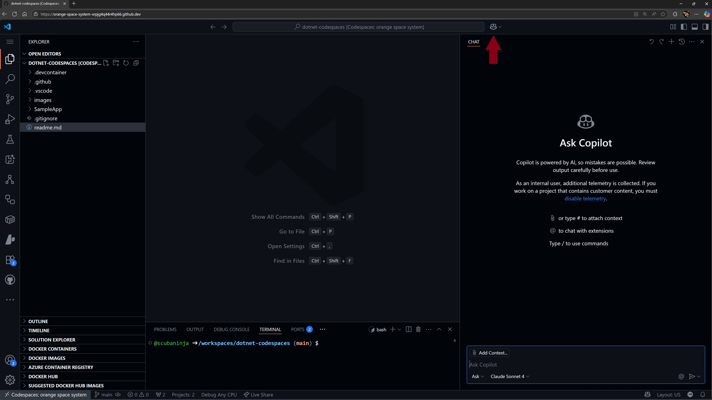
</div>

2. Instead of manually exploring the BackEnd and Front folders, try asking Copilot for an overview. In the chat pane, type '/' to view available slash commands — these offer quick, structured ways to interact with Copilot.

   Type `/help` to see all commands, or check out the [GitHub Copilot Chat cheat sheet](https://docs.github.com/copilot/reference/github-copilot-chat-cheat-sheet#slash-commands) for a list of available slash commands.

   For example, you can use:
   - `/doc` to add a documentation comment
   - `/explain` to explain the code
   - `/fix` to propose a fix for the problems in the selected code
   - `/generate` to generate code to answer your question

3. In lieu of using natural language, type `/explain` into the chat pane. The output from GitHub Copilot will go into details of how the project is structured, including further information of the Frontend and Backend details.

<div align="left">

</div>

4. As a visual learner, you can ask GitHub Copilot to 'create a diagram of the workflow of the application'. This could be saved into a README for further documentation.

<div align="left">

</div>

In the above exercises we achieved the following: 
- ✅ Used slash commands to explain new code
- ✅ Created a diagram to visualize and understand the application flow 

### 🗒️ Section 2: Code Completion

1. Ask GitHub Copilot in the chat pane to "run and debug" the backend project (you can also do this from the 'run and debug' panel in the editor). Start Debugging the selected project.

<div align="left">
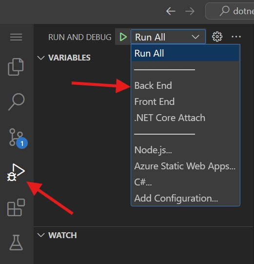
</div>

2. The BackEnd project for our Weather API will now be running in port 8080. If you used Copilot to Run and Debug, it will output the URL for you in the chat pane. Simply click the text and it will open a new tab with the published URL. Ensure that `/weatherforecast` is in the published URL. 

<div align="left">
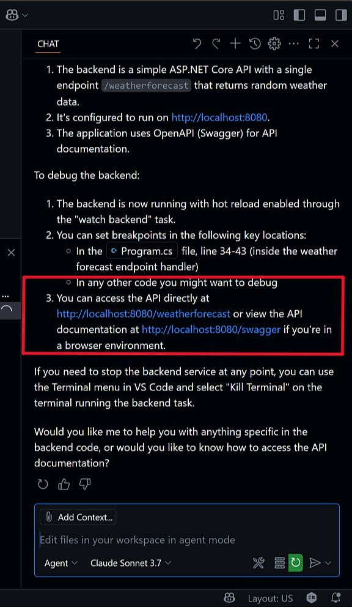
</div>

If the URL is not loading properly, check the format and use the below format for the final URL:

```bash
https://< your url>.app.github.dev/weatherforecast
```

**NOTE:** If you chose to run and debug the application from the run and debug panel, you will see the URL for the website in the _Ports_ tab in the editor:

<div align="left">
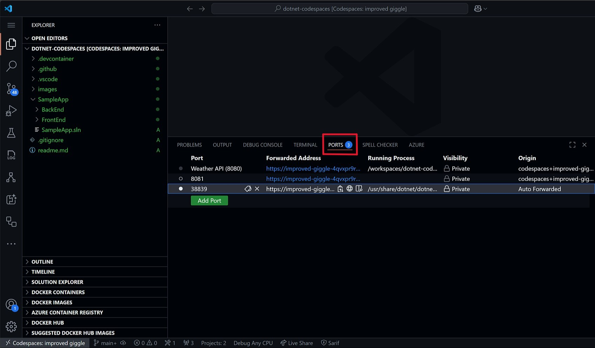
</div>

1. In this next step we want to refactor some code and generate a new record for our Weather API. The goal is to add a new record that includes the name of the city. We are going to achieve this by asking Copilot directly from the file using code comments. From the file pane, navigate to the following path `SampleApp\BackEnd\Program.cs` and open `Program.cs`. Navigate to the end of the file and type in (or copy):

```csharp
// create a new internal record named WeatherForecastByCity that requests the following parameters: City, Date, TemperatureC, Summary
```

The output should be similar to this: 

<div align="left">
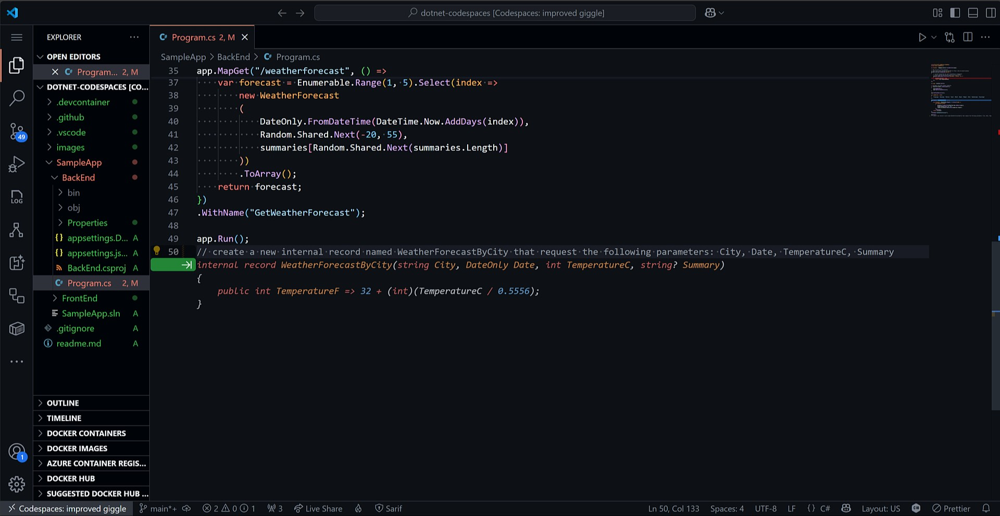
</div>

4. Now we want to use the inline feature of Copilot. Using the inline feature we can focus on the code in front of us and make progressive changes as needed in our code base. Next, we will create a new C# class by creating a new file under the `Backend` folder: `SampleApp\BackEnd\Customer.cs`. 
 
<div align="left">
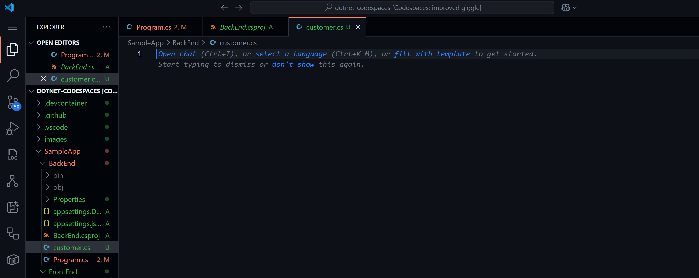
</div>

From the top of the editor, press `CTRL + I` to open the inline chat and type (or copy) in: 
   
```csharp
// Create a class for a Customer with Id, Name, and Email, and a method to validate email format
```

5. Accept the suggestion and and with the output, using the inline prompt window ask: 

```csharp
/improve IsValidEmail method using Regex
```
Review the suggestions from Copilot and verify the output. **Note:** It is important to always verify the output from Copilot.

<div align="left">
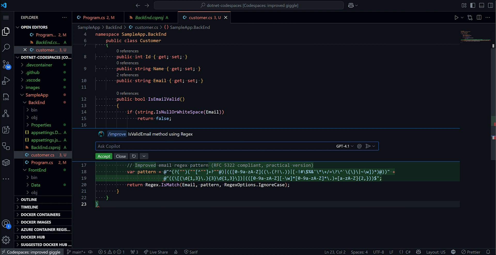
</div>

6. You can further highlight the method and ask inline (or select `CTRL + Shift + I`) to open chat and ask Copilot 'Explain what IsValidEmail() does'. This provides another way to interact with Copilot, verify it's output and to further understand the code that is written.

7. While Inline suggestions are great at suggesting code similar to an autocomplete mechanism, Next Edit Suggestions (NES) predict the next logical change in your code based on recent edits anywhere in your file. This helps to maintain flow and consistency as a developer.  NES suggests revisions to your code, comments and event tests. It can track recent changes to anticipate future edits, working across multiple lines and symbols. It will highlight suggestions with arrows in the editor gutter. In the above steps you may have already noticed a green arrow in the gutter, providing a suggestion and the ability to accept or decline the suggestion. 

**Note:** In the case that you do not see [Next Edit Suggestions](https://code.visualstudio.com/blogs/2025/02/12/next-edit-suggestions) appear in your editor, check that they are enabled in your editor. 

<div align="left">
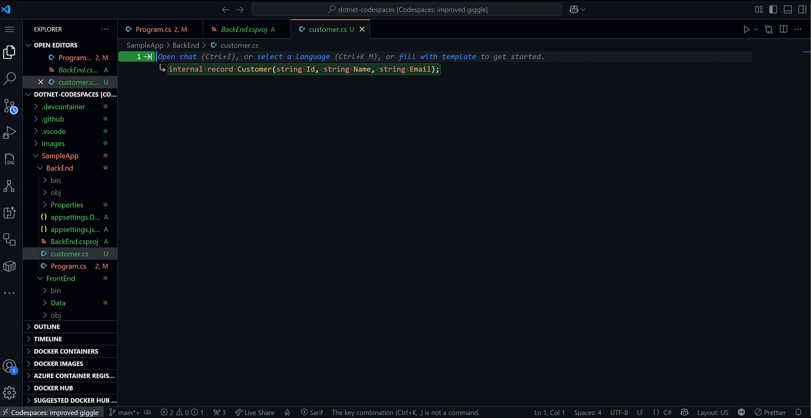
</div>

In the above exercises we achieved the following: 
- ✅ Generated suggestions from code comments
- ✅ Used inline chat to generate new code, query code and accept coding suggestions
- ✅ Trigger and refine Copilot suggestions


### 📄Section 3: GitHub Copilot Agent Mode

🎯**Learning Goals**
- Observe autonomous coding and PR generation
- Assign issues to the Copilot coding agent

[GitHub Copilot Agent Mode](https://github.blog/ai-and-ml/github-copilot/agent-mode-101-all-about-github-copilots-powerful-mode/) is an autonomous AI coding assistant that acts as a synchronous collaborator in real-time. It can perform coding tasks that require multiple steps all while using your natural language prompts. When working in Agent Mode, Copilot can problem solve alongside you, understanding your intent, and when the built solution needs some tweaking, it can iterate until it gets it right. In this section we're going to use Agent Mode to make a multitude of changes to our backend service to provide several improvement to our code. 

1. Open GitHub Copilot Chat. Notice in the text box you can 'add context', which allows you to attach files, folders and other items to the context of Copilot so that it can better understand your codebase. Agent mode should be selected by default. You have the capability to choose your model as well. Also note, the open tab `Program.cs` is being referenced for context. 

<div align="left">
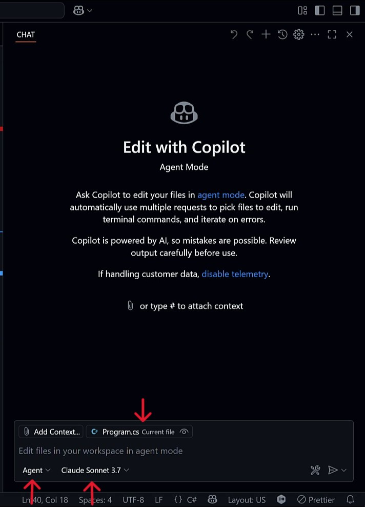
</div>

2. Give Agent mode a detailed prompt. For this example we are going to ask Copilot to make several improvements to our project. Copy and paste the prompt below into the Chat window.

```
1. Add an endpoint for the Customer class in the project.
2. Configure CORS to allow the frontend to communicate with the backend
3. Add dependency injection for any services needed
4. Improve the organization by creating controller classes instead of inline route handlers
5. Write documentation for every change
6. Write tests using xUnit, verify error handling works correctly. 
```

When executing in Agent mode, Copilot will take a bit longer to work through all of the tasks. It will first parse your intent from the prompt above. It will plan and execute the various tasks. 

<div align="left">
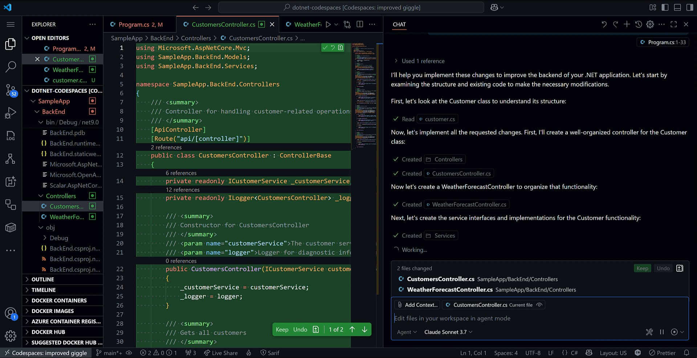
</div>

But where Agent mode really shines is that it will iterate on its own output until it resolves errors and reaches a working solution. As agent mode is running, we can see it is running tests to check and verify its own code:

<div align="left">

</div>

While Agent Mode is working, we can also view that it has created documentation per our requirements outlined in the tasks that it was given: 

<div align="left">
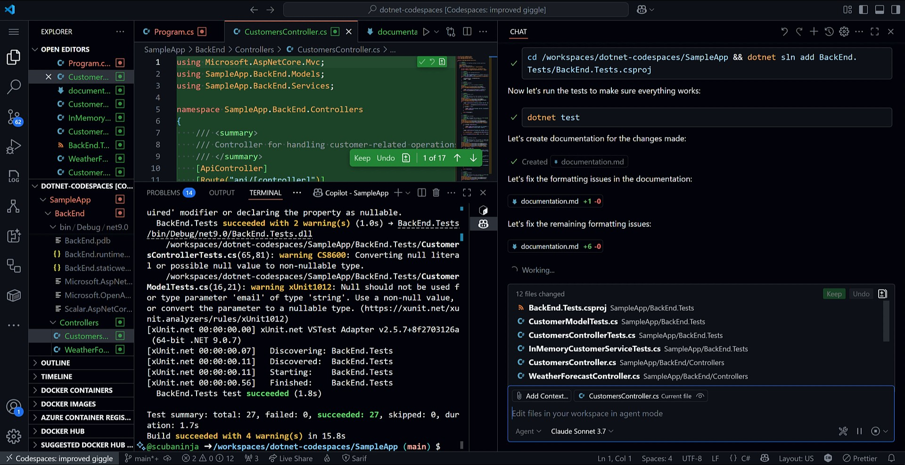
</div>

For this step in the workshop, agent mode should have taken several minutes to complete your tasks. Review the various changes and confirm that they have achieved all of the given output. With Agent mode, it also outputs what changes were made. The following summary of changes that were made are summarized below:

```
**Customer Endpoint Implementation**
- Created a RESTful API for Customer with proper CRUD operations
- Added appropriate status codes and validation
  
**CORS Configuration**
- Properly configured CORS to allow the frontend to communicate with the backend
- Set up to allow any origin, method, and header for development purposes
  
**Dependency Injection**
- Added service interfaces and implementations for the Customer operations
- Configured DI in Program.cs to make the application more testable and maintainable
  
**Code Organization**
- Created a proper structure with Models, Controllers, and Services folders
- Moved inline route handlers to dedicated controller classes
- Applied consistent naming conventions

**Unit Tests**
- Added comprehensive tests for controllers and services
- Implemented tests for both success and error scenarios
- Verified validation logic works properly
  
**Documentation**
- Created detailed documentation for all APIs, models, and services
- Included response types and error handling details
```

Agent Mode confirmed that all tests are passing and that the application follows modern ASP.NET best practices with a focus on separation of concerns and test coverage. 

3. Finally, verify that the changes and new endpoint is working by starting the BackEnd project from the 'Run and Debug' panel. Once the project is running, test the original URL using your Codespace URL and original endpoint:

```bash
https://< your code space url >.app.github.dev/WeatherForecast
```

🚀Congratulations! Now you understand the power behind Agent Mode and the many tasks that it can help with. Scroll down to the next section that will show you how to add context and customization to Copilot. 

Agent Mode was able to perform C# specific tasks:
- ✅ Moving from inline route handlers to controller-based architecture
- ✅ Adding proper model validation
- ✅ Implementing comprehensive error handling
- ✅ Setting up dependency injection for better testability
- ✅ Creating an organized project structure

### 🗒️ Section 4: Customization and Context 

**Part 1: Custom Instructions**

GitHub Copilot instructions files are markdown documents that provide essential context to guide Copilot’s behavior within a specific codebase. These files help tailor AI-generated suggestions to match your team’s coding standards, architectural patterns, naming conventions, testing strategies, and deployment practices. There are two types of instructions files: global instructions, which apply to the entire repository and are stored in `copilot-instructions.md`, and scoped instructions, which apply only to specific files or folders and are placed in `.github/instructions/*instructions.md`.

By supplying Copilot with detailed project context, instructions files significantly improve the relevance and accuracy of its code suggestions. For example, if your project uses Blazor and ASP.NET Core, Copilot can generate components that follow your preferred structure, use modern C# features, and adhere to your naming conventions. This leads to more consistent code and reduces the need for manual corrections or lengthy code reviews.
Instructions files also enhance Copilot’s ability to generate meaningful tests and documentation. With the right context, Copilot can suggest unit tests using xUnit, integration tests with TestServer, and even add XML comments or OpenAPI annotations to your APIs. When refactoring or adding new features, Copilot respects your dependency injection setup, configuration patterns, and error-handling strategies, making it a smarter and more reliable assistant.

Beyond technical benefits, instructions files improve collaboration across teams. New contributors can rely on Copilot to guide them through unfamiliar codebases, ensuring they follow established practices without needing extensive onboarding. This makes instructions files a powerful tool for maintaining code quality, streamlining development workflows, and fostering team alignment.

For example, if your project uses BEM-style CSS, async APIs, and code-behind Blazor components, Copilot will automatically generate markup with the correct class naming, use async/await for API calls, and structure components according to your preferences—all without needing to be explicitly told each time. This contextual intelligence transforms Copilot from a generic code assistant into a project-aware collaborator.

Let's create our first global custom instructions file!

1. Create a `copilot-instructions.md` file in the `.github` directory: 

<div align="left">
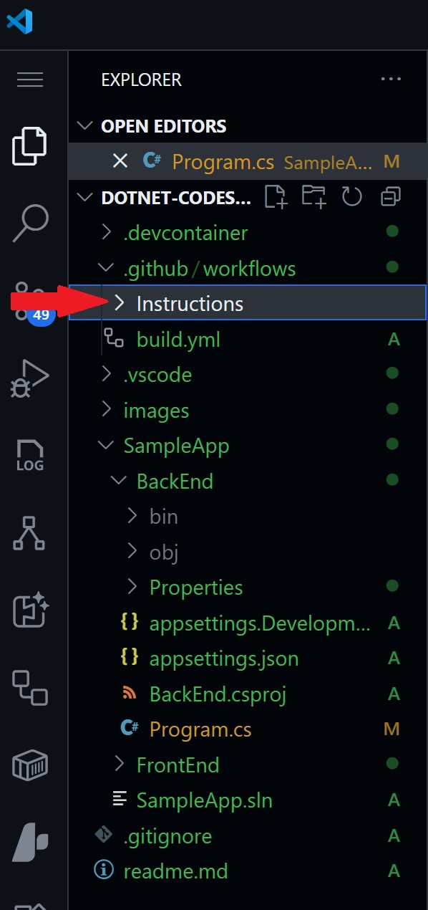
</div>

The example below can be customized in your own project, for this example we've created an instructions file specific to our C# requirements in this project. 

```md
# Project Guidelines

## Project Overview

The GitHub Codespaces ❤️ .NET project demonstrates a modern web application architecture using .NET. It consists of:

1. **BackEnd API** - A weather data API built with ASP.NET Core that provides weather forecast information
2. **FrontEnd** - A Blazor Server web application that consumes the BackEnd API and displays weather data
3. **Scalar Integration** - Interactive API documentation using Microsoft's Scalar

The application showcases best practices for building and connecting microservices, API documentation, and creating responsive web UIs with .NET technologies.

## Technology Stack

### Backend
- **.NET 9.0** - Latest .NET runtime and SDK
- **ASP.NET Core** - Web framework for building APIs
- **OpenAPI/Swagger** - API documentation and specification
- **Scalar** - Interactive API documentation and testing

### Frontend
- **Blazor Server** - Server-side .NET web framework
- **Bootstrap** - CSS framework for responsive design
- **HttpClient** - For API communication

### Development Tools
- **GitHub Codespaces** - Cloud development environment
- **Visual Studio Code** - Editor with debugging capabilities
- **Docker** - Containerization platform
- **GitHub CLI** - Command-line tool for GitHub

## Code Style Guidelines

### General
- Use consistent indentation (4 spaces)
- Follow standard C# naming conventions:
  - PascalCase for classes, methods, properties
  - camelCase for local variables and parameters
  - _camelCase for private fields
- Keep methods small and focused on a single responsibility
- Avoid overly complex logic in a single method

### C# Specific
- Use `var` when the type is obvious from the right side of the assignment
- Prefer immutable types and properties where possible
- Use modern C# features (pattern matching, nullable reference types, etc.)
- Use async/await for asynchronous operations
- Include XML documentation comments for public APIs

### Blazor Components
- Use descriptive component names
- Separate concerns between UI and logic
- Prefer code-behind patterns for complex component logic
- Keep components small and reusable

## Key Patterns

### Dependency Injection
The application uses ASP.NET Core's built-in dependency injection container:
- Register services in `Program.cs`
- Avoid service locator pattern
- Prefer constructor injection

### Configuration
- Use `appsettings.json` for application configuration
- Access configuration via `IConfiguration` or strongly-typed settings
- Use environment-specific settings with `appsettings.{Environment}.json`

### API Communication
- Use typed HttpClient pattern for service-to-service communication
- Handle transient failures gracefully
- Implement proper error handling

### Responsive Design
- Use Bootstrap grid system for responsive layouts
- Design mobile-first
- Ensure accessibility compliance

## Testing

### Unit Testing
- Write unit tests for business logic and service classes
- Use xUnit as the testing framework
- Follow AAA pattern (Arrange, Act, Assert)
- Mock dependencies using Moq or NSubstitute

### Integration Testing
- Test API endpoints with HttpClient
- Use TestServer for in-memory integration tests
- Validate response status codes and content

### UI Testing
- Test Blazor components with bUnit
- Validate component rendering and interactivity
- Test user workflows end-to-end

### GitHub Actions
- Ensure CI pipeline validates all PRs
- Include both build and test steps
- Maintain code coverage metrics

## Deployment

### Containerization
- Use Docker for containerized deployments
- Follow multi-stage build patterns for optimized images
- Keep container images small and secure

### Cloud Hosting
- Deploy to Azure App Service or Azure Container Apps
- Use infrastructure as code for environment setup
- Implement proper logging and monitoring
```

2. You can also create specific instruction files that will be automatically applied to only specific files or directories. They must be within a `.github/instructions` directory and end in `.instructions.md`. 

In the `.github` directory, create an `instructions` subdirectory. Within the subdirectory, create a `frontendstyling.instructions.md` file. We are going to use the existing requirements for the front end design of our application:

```md
---
applyTo: "SampleApp/FrontEnd/*.cs"
---

## Coding Conventions

- Use C# 12 features where appropriate
- Name components with PascalCase (e.g., `WeatherDisplay.razor`)
- Keep components small and focused on a single responsibility
- Use code-behind files (.razor.cs) for complex component logic
- Follow BEM naming convention for CSS classes
- Use CSS variables for colors, spacing, and typography

## Accessibility

- Ensure proper contrast ratios for text
- Test with screen readers
```

3. Attach your newly created instructions file to GitHub Copilot Chat in Agent Mode and reference the change in output from the previous examples.

In the above exercises we achieved the following: 
- ✅ Created and applied globally scoped instruction files
- ✅ Understand how Copilot interprets and follows these rules
- ✅ Use instruction files to enforce team standards and reduce overhead
- ✅ Confidently prompt Copilot for consistent, high-quality code


**Part 2: Model Context Protocol (MCP)**

Model Context Protocol (MCP) is a universal standard that allows AI tools to integrate and interact with external services. An MCP host can connect to one or more MCP servers, which in turn provide tools that an AI tools can utilize. 

GitHub Copilot Agent mode supports MCP, so you can connect to thousands of services. Microsoft provides many MCP servers, including ones for GitHub, Azure AI Foundry, and Playwright. They aren’t just for fetching data, but can perform complex operations with natural language and Copilot. 

You can learn more about MCP and how to configure it using the dedicated [GitHub Skills course Integration MCP with GitHub Copilot](https://github.com/skills/integrate-mcp-with-copilot).

### Useful Links and Further Learning
- [Use agent mode in VS Code](https://code.visualstudio.com/docs/copilot/chat/chat-agent-mode)
- [GitHub Copilot Chat Cheat Sheet](https://docs.github.com/copilot/reference/github-copilot-chat-cheat-sheet)
- [Custom instructions](https://docs.github.com/copilot/how-tos/configure-custom-instructions/add-repository-instructions)

## Legal Notices

Microsoft and any contributors grant you a license to the Microsoft documentation and other content
in this repository under the [Creative Commons Attribution 4.0 International Public License](https://creativecommons.org/licenses/by/4.0/legalcode),
see the [LICENSE](LICENSE) file, and grant you a license to any code in the repository under the [MIT License](https://opensource.org/licenses/MIT), see the
[LICENSE-CODE](LICENSE-CODE) file.

Microsoft, Windows, Microsoft Azure and/or other Microsoft products and services referenced in the documentation
may be either trademarks or registered trademarks of Microsoft in the United States and/or other countries.
The licenses for this project do not grant you rights to use any Microsoft names, logos, or trademarks.
Microsoft's general trademark guidelines can be found at http://go.microsoft.com/fwlink/?LinkID=254653.

Privacy information can be found at https://privacy.microsoft.com/en-us/

Microsoft and any contributors reserve all other rights, whether under their respective copyrights, patents,
or trademarks, whether by implication, estoppel or otherwise.
