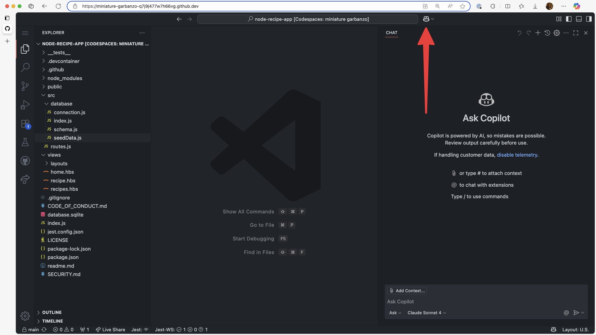
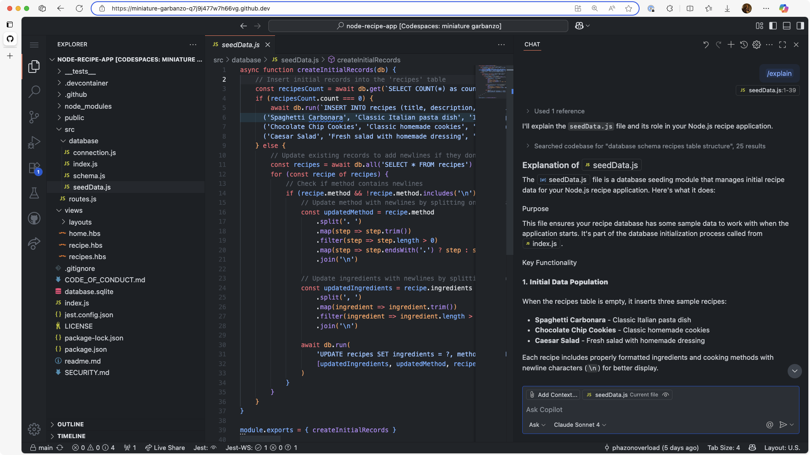
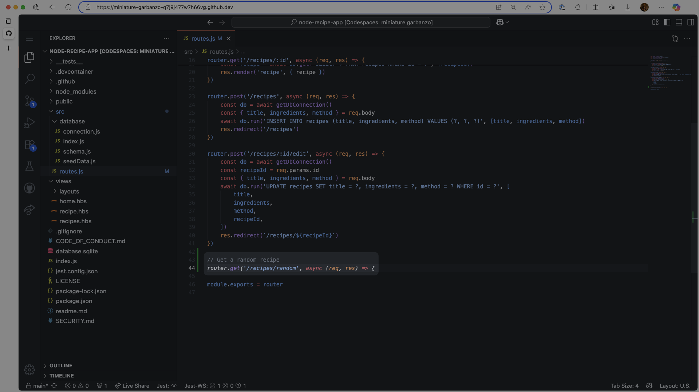
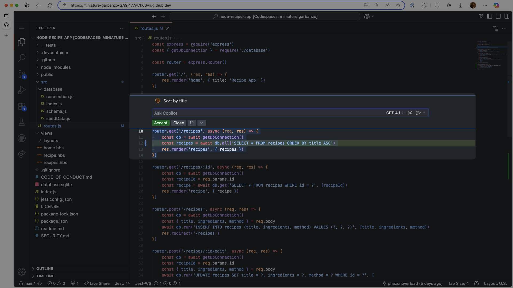
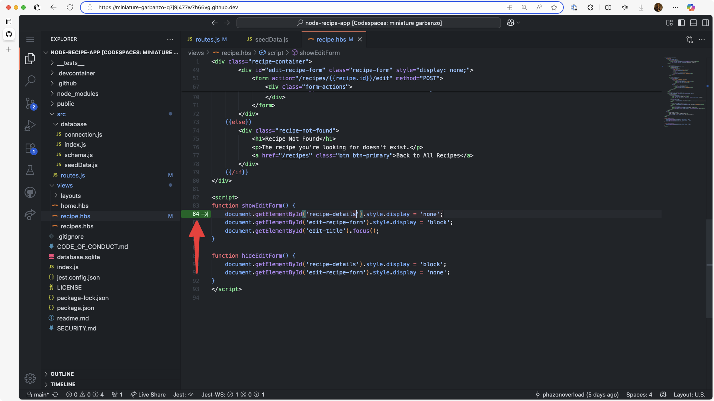
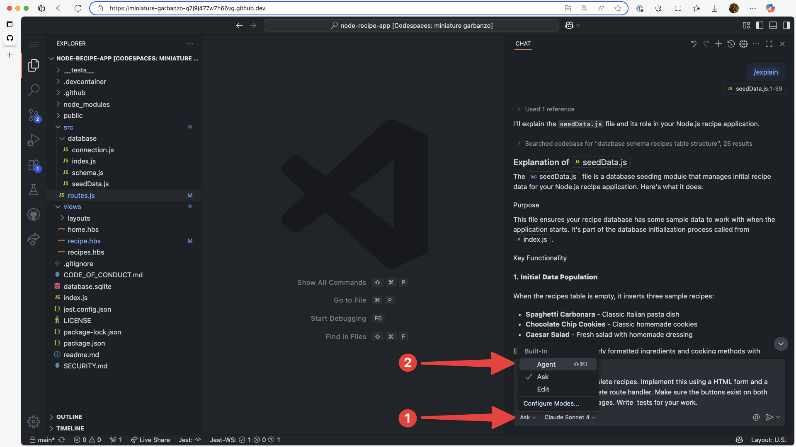

<header>

# Using GitHub Copilot with JavaScript

In this hands-on module, you'll master GitHub Copilot's powerful features—from basic code completions to advanced agent capabilities and customization options. You'll learn to leverage AI assistance effectively in your development workflow, exploring how Copilot can understand context, generate complex code structures, and adapt to your specific needs through custom instructions and contextual knowledge.

By the end of this workshop, you'll transform from a Copilot beginner to a power user, capable of crafting precise prompts, utilizing autonomous coding agents, and customizing Copilot to match your team's unique requirements. 

This module can be completed in about an hour.

</header>

By the end of this module, you’ll be able to:
- Use Copilot’s code generation features, such as Next Edit Suggestions and Agent mode. 
- Customize Copilot’s responses with custom instructions, prompt files, and chat modes. 
- Understand the purpose of MCP, configure an MCP server, and use MCP tools. 

## 📖 Prerequisite reading

- [Introduction to prompt engineering with GitHub Copilot](https://learn.microsoft.com/training/modules/introduction-prompt-engineering-with-github-copilot//?WT.mc_id=academic-113596-abartolo)
- [Using GitHub Copilot with JavaScript](https://learn.microsoft.com/training/modules/introduction-copilot-javascript/?WT.mc_id=academic-113596-abartolo)


## 📋 Requirements

1. Enable your [GitHub Copilot service](https://github.com/github-copilot/signup)
1. Open [this repository with Codespaces](https://codespaces.new/github-samples/node-recipe-app?quickstart=1)

**Right click the following Codespaces button to open your Codespace in a new tab**

[](https://codespaces.new/github-samples/node-recipe-app?quickstart=1)

This application is a recipe app that allows users to create, edit, and read recipes. Before this module, there are notable missing features including the ability to delete and search recipes. But don’t worry, Copilot is here to help! 

## 🧑‍💻 Section 1: Exploring your project

**🎯 Learning Goals**

- Understand how to use Copilot Chat for codebase exploration.
- Be able to use built-in slash commands for common operations.

Once your Codespace launches, you'll have a fully functional development environment with the entire repository preloaded. This is the perfect time to explore GitHub Copilot Chat to help you better understand the codebase.

Click the Copilot Chat icon in the top-right corner of the Codespace window Open GitHub Copilot Chat. Make sure that Agent is selected in the mode selection dropdown. 



Instead of manually exploring the various files across directories, try asking Copilot for an overview. In the chat pane, type '/' to view available slash commands — these offer quick, structured ways to interact with Copilot. 

Type '/help' to see all commands, or check out the [GitHub Copilot Chat cheat sheet](https://docs.github.com/copilot/reference/github-copilot-chat-cheat-sheet#slash-commands) for a list of slash commands available. For example, you can use:

- `/doc` to add a documentation comment
- `/explain` to explain the code
- `/fix` to propose a fix for the problems in the selected code
- `/generate` to generate code to answer your question

You can also provide files or blocks of code as context. Open `src/database/seedData.js` and then type `/explain` in the chat pane. By default, the currently open editor will be added to context. If specific parts of the file are selected, only that text will be added as context. 



## 🧑‍💻 Section 2: Code completion

**🎯 Learning Goals**

- Use inline code completion to write code from comments.
- Trigger and refine Copilot completions.
- Use inline chat and slash commands.

In the previous section you learned how to use both natural language or slash commands to quickly understand the codebase without digging through folders. In the next set of exercises we're going to use Copilot to create a new route handler using code completion.

Open the `src/routes.js` file. Just above the final line where the router is exported, add the following comment:

```
// Get a random recipe
```

Copilot will suggest code - you can hit the tab key on your keyboard to accept the suggestion. Quite often, Copilot will only generate one or a few lines at a time with inline code completion and then suggest the following lines, so you may need to hit tab a few times to complete the route handler. 



You can also open Copilot directly where you edit text for quick questions or modifications. Open the `src/routes.js` file and highlight the following code block: 

```js
router.get('/recipes', async (req, res) => {
	const db = await getDbConnection()
	const recipes = await db.all('SELECT * FROM recipes')
	res.render('recipes', { recipes })
})
``` 

Press `CTRL + I` (Windows) or `CMD + I` (Mac) to open inline chat. This is a good place for small explanations or modification requests. Type “Sort by title” and hit enter. You should see a small change to the SQL query which you can accept or follow up with further requests. 



You can also enable Next Edit Suggestions in settings. Once enabled, Copilot analyses your code history, the structure of your codebase, conventions and behaviors, and predicts the logical next step after you make a change. Just like with code completion, you can hit tab to accept the change. 



## 🧑‍💻 Section 3: Agent mode

**🎯 Learning Goals**

- Implement a new feature autonomously in your code editor with GitHub Copilot Agent mode.

Agent mode lets you hand Copilot a high-level prompt and then watch as it autonomously plans the steps, selects the right files, runs tools or terminal commands, and iterates on code edits until the task is complete. 

Agent mode runs within your code editor and will detail the steps it will take to complete the task in your prompt. Making sure that ‘Agent’ is selected in the Copilot Chat pane, provide the following prompt: 

```
Implement the ability to delete recipes. Implement this using a HTML form and a new POST /recipes/:id/delete route handler. Make sure the buttons exist on both the recipe view and edit pages. Write  tests for your work.
```


Copilot will examine your codebase and then make requisite changes over multiple files, creating new ones if required. If Copilot wants to run terminal commands, it will ask. If tests fail, Copilot will recognize this and automatically continue work providing its reasoning. 

## 🧑‍💻 Section 4: Customization & context

**🎯 Learning Goals**

- Understand the different ways to customize GitHub Copilot. 
- Understand the role of Model Context Protocol (MCP).

### Part 1: Custom Instructions

GitHub Copilot instructions files are markdown documents that provide essential context to guide Copilot’s behavior within a specific codebase. 

These files help tailor AI-generated suggestions to match your team’s coding standards, architectural patterns, naming conventions, testing strategies, and deployment practices. 

There are two types of instructions files: global instructions, which apply to the entire repository and are stored in `copilot-instructions.md`, and scoped instructions, which apply only to specific files or folders and are placed in `.github/instructions/*.instructions.md`.

By supplying Copilot with detailed project context, instructions files significantly improve the relevance and accuracy of its code suggestions. For example, if your project uses specific libraries and frameworks, Copilot can generate components that follow your preferred structure, use modern JavaScript features, and adhere to your naming conventions. This leads to more consistent code and reduces the need for manual corrections or lengthy code reviews.

Instructions files also enhance Copilot’s ability to generate meaningful tests and documentation. With the right context, Copilot can suggest unit tests. When refactoring or adding new features, Copilot respects your configuration, patterns, and error-handling strategies, making it a smarter and more reliable assistant.

Beyond technical benefits, instructions files improve collaboration across teams. New contributors can rely on Copilot to guide them through unfamiliar codebases, ensuring they follow established practices without needing extensive onboarding. This makes instructions files a powerful tool for maintaining code quality, streamlining development workflows, and fostering team alignment. This contextual intelligence transforms Copilot from a generic code assistant into a project-aware collaborator.

Global custom instructions file will be automatically included in every request in GitHub Copilot chat. To create one, create a `copilot-instructions.md` file in the `.github` directory: 

```md
# GitHub Copilot Instructions

## Project Overview
This is a CRUD recipe application built with Node.js, Express, and Handlebars templating engine. The app allows users to create, read, update, and delete recipes with ingredients and cooking methods.

## Technology Stack
- **Backend**: Node.js with Express.js
- **Database**: SQLite with custom database layer
- **Templating**: Handlebars.js
- **Testing**: Jest
- **Styling**: Vanilla CSS

## Code Style Guidelines
- Use ES6+ features and async/await for asynchronous operations
- Follow RESTful routing conventions for recipe operations
- Use semantic HTML and BEM-style CSS classes where appropriate
- Keep database queries in the `src/database/` directory
- Store all view templates in the `views/` directory with Handlebars syntax

## Key Patterns
- Database operations should use the custom connection layer in `src/database/`
- Routes are defined in `src/routes.js` following Express patterns
- Handlebars helpers for text formatting (split, newline, add) are available
- Use proper error handling for database operations and route handlers
- Follow the existing form structure for CRUD operations

## Testing
- Test files are in `__tests__/` directory
- Use Jest for unit and integration testing
- Include tests for both database operations and route handlers
- Mock database connections in tests using the test setup files
```

You can also create specific instruction files that will be automatically applied to only specific files or directories. They must be within a `.github/instructions` directory and end in `.instructions.md`. 

In the `.github` directory, create an `instructions` subdirectory. Within the subdirectory, create a `styling.instructions.md` file:

```md
---
applyTo: "public/*.css"
---

- Use semantic class names (`.recipe-*`, `.btn-*`, `.form-*`)
- Follow BEM methodology where appropriate
- Use consistent spacing units (8px, 16px, 24px)
- Use CSS custom properties for colors
- Mobile-first responsive design
- Use flexbox for layouts
- Ensure accessibility with proper contrast and focus states
- Ensure buttons have adequate touch targets (44px minimum)
```

### Part 2: Model Context Protocol (MCP)

Model Context Protocol (MCP) is a universal standard that allows AI tools to integrate and interact with external services. An MCP host can connect to one or more MCP servers, which in turn provide tools that an AI tools can utilize. 

GitHub Copilot Agent mode supports MCP, so you can connect to thousands of services. Microsoft provides many MCP servers, including ones for GitHub, Azure AI Foundry, and Playwright. They aren’t just for fetching data, but can perform complex operations with natural language and Copilot. 

You can learn more about MCP and how to configure it using the dedicated [GitHub Skills course](https://github.com/skills/integrate-mcp-with-copilot) or deep dive with [MCP for Beginners](https://github.com/microsoft/mcp-for-beginners).

## 📘 Further learning

- [Use agent mode in VS Code](https://code.visualstudio.com/docs/copilot/chat/chat-agent-mode)
- [GitHub Copilot Chat Cheat Sheet](https://docs.github.com/copilot/reference/github-copilot-chat-cheat-sheet)
- [Custom instructions](https://docs.github.com/copilot/how-tos/configure-custom-instructions/add-repository-instructions)