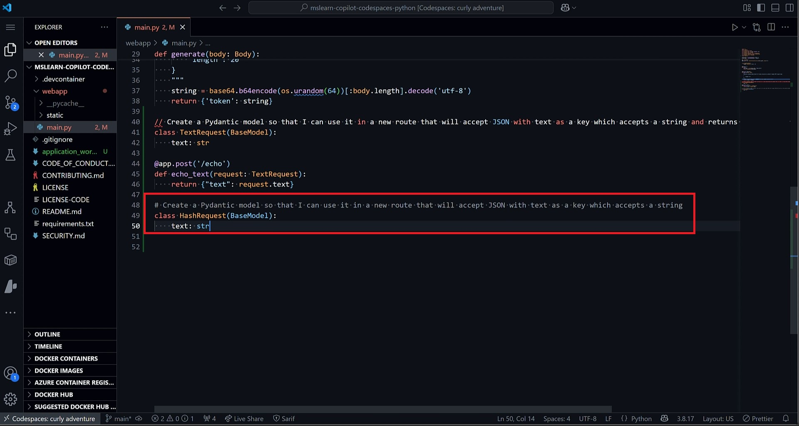
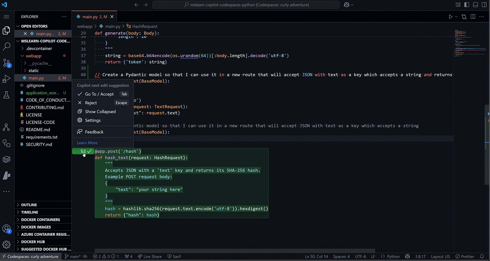
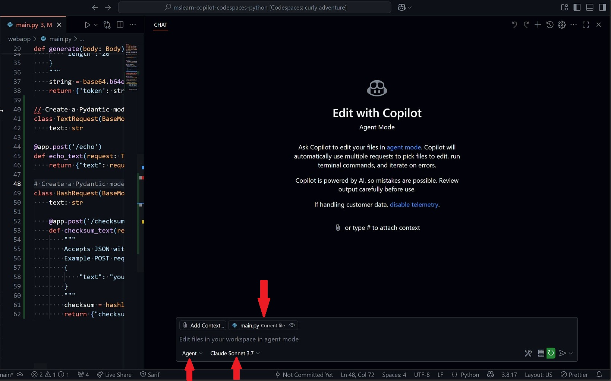
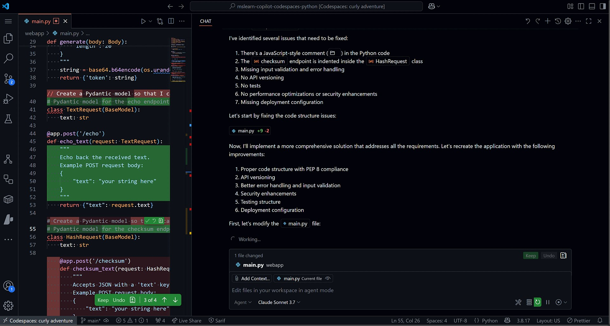
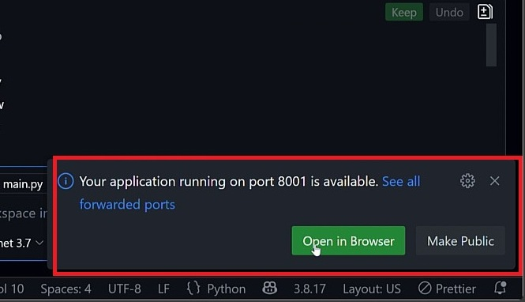
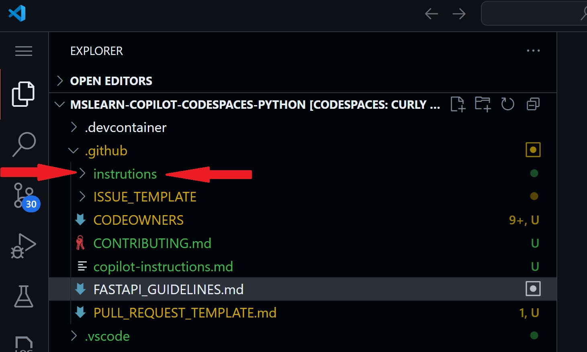

<header>

# Using GitHub Copilot with Python

Welcome to a hands-on, multi-module course that transforms GitHub Copilot from a simple autocomplete tool into your proactive AI pair programmer. Whether you’re new to AI-assisted coding or looking to deepen your expertise, in this module you will learn how to leverage Copilot's features and enhance your efficiency when coding in Python. You will gain a clear understanding of Copilot's core capabilities and how they fit into modern Python workflows. This is a hands-on experience with getting to understand inline suggestions, natural-language prompting and context-aware code suggestions.

Prepare to tackle a practical, hands-on project! You’ll work on modifying a Python repository to build an interactive HTML form and an API endpoint. This hands-on project will provide valuable experience in creating a Python web application that serves an HTTP API and generates pseudo-random tokens for identification purposes.

</header>


- **Who this is for**: Developers, DevOps Engineers, Software development managers, Testers.
- **What you'll learn**: How to use GitHub Copilot for code completion, inline suggestions and next edit suggestions, as well as adding comments to your work.
- **What you'll build**: Python files that will have code generated by Copilot AI for code and comment suggestions.
- **Prerequisites**: GitHub Copilot is available to use for free, sign up for [GitHub Copilot](https://gh.io/copilot).
- **Timing**: This module can be completed in under an hour.

By the end of this module, you'll acquire the skills to be able to:

- Engage with Copilot in the IDE using inline suggestions and next-edit completions. 
- Craft prompts to generate suggestions from GitHub Copilot using code completion and chat.
- Apply GitHub Copilot to improve your projects.

## Prerequisite reading:
- [Introduction to prompt engineering with GitHub Copilot](https://learn.microsoft.com/training/modules/introduction-prompt-engineering-with-github-copilot//?WT.mc_id=academic-113596-abartolo)
- [Using GitHub Copilot with Python](https://learn.microsoft.com/en-us/training/modules/introduction-copilot-python/?WT.mc_id=academic-113596-abartolo)

## Requirements

1. Enable your [GitHub Copilot service](https://github.com/github-copilot/signup)
   
2. Open [this repository with Codespaces](https://codespaces.new/MicrosoftDocs/mslearn-copilot-codespaces-python)

## 💪🏽 Exercise

**Right click the following Codespaces button to open your Codespace in a new tab**
 
[](https://codespaces.new/MicrosoftDocs/mslearn-copilot-codespaces-python)

The API already has a single endpoint to generate a token. Let's update the API by adding a new endpoint that accepts text and returns a list of tokens.

### 🗒️ Section 1: Exploring Your Project 

🎯**Learning Goals**
- Use inline code completion to scaffold new classes and methods
- Trigger and refine Copilot completions
- Use inline chat and slash commands
  
Once your Codespace launches, you'll have a fully functional development environment with the entire repository preloaded. This is the perfect time to explore GitHub Copilot Chat to help you better understand the codebase.

To get started:

1. Click the Copilot Chat icon in the top-right corner of the Codespace window:

<div align="left">

</div>

2. Instead of manually exploring the project and various folders, try asking Copilot for an overview. In the chat pane, type '/' to view available slash commands — these offer quick, structured ways to interact with Copilot.

   Type `/help` to see all commands, or check out the [GitHub Copilot Chat cheat sheet](https://docs.github.com/copilot/reference/github-copilot-chat-cheat-sheet#slash-commands) for a list of available slash commands.

   For example, you can use:
   - `/doc` to add a documentation comment
   - `/explain` to explain the code
   - `/fix` to propose a fix for the problems in the selected code
   - `/generate` to generate code to answer your question

3. In lieu of using natural language, type `/explain` into the chat pane. The output from GitHub Copilot will go into details of how the project is structured, including further information of the Frontend and Backend details.

<div align="left">

</div>

4. As a visual learner, you can ask GitHub Copilot to 'create a diagram of the workflow of the application'. This could be saved into a README for further documentation.

<div align="left">

</div>

In the above exercises we achieved the following: 
- ✅ Used slash commands to explain new code
- ✅ Created a diagram to visualize and understand the application flow 
  
### 🗒️ Section 2: Code Completion

**🎯 Learning Goals**

- Use inline code completion to write code from comments.
- Trigger and refine Copilot completions.
- Use inline chat and slash commands.

In the previous section you learned how to use both natural language or slash commands to quickly understand the codebase without digging through folders. In the next set of exercises we're going to use Copilot to add a `Pydantic` model and generate a new endpoint. 

1. Open the file pane and navigate to `webapp/main.py`. Open the `main.py` file, navigate to the end of the files and type in (or copy):

```python
# Create a Pydantic model so that I can use it in a new route that will accept JSON with text as a key which accepts a string
```

The output should be similar to this: 

<div align="left">

</div>

2. Now we want to use the inline feature of Copilot. When using the inline feature we can focus on the code in front of us and make progressive changes in our code base. Next, we are going to generate a new endpoint at the bottom of the `main.py` file. Place your cursor under the last route that was created and prest `CTRL + I` to open inline chat. Type or copy in the following text: 

```python
# Create a FastAPI endpoint that accepts a POST request with a JSON body containing a single field called "text" and returns a checksum of the text 
```

<div align="left">

</div>

3. Accept the suggestion and highlight the block of text that Copilot has outputted. Open the inline prompt window again (`CRTL + I`) and type in:

```python
/improve 
```

<div align="left">

</div>

Review the suggestions from Copilot and verify the output. In this instance we combined both the slash command ability and the inline chat feature. **Note:** It is important to always verify the output from Copilot.

5. After generating the `/checksum` endpoint code, you can explore a bit further with Copilot. Here are a few other suggestions that you could try, open inline chat and type (or copy) the following: 

```python
Enhance the checksum endpoint to accept a 'hash_type' parameter that can be 'md5', 'sha1', or 'sha256'
```

```python
Add validation to ensure text is not empty and has a maximum length of 1000 characters
```

```python
Improve the docstring for the checksum_text function with more details and examples
```

7. While Inline suggestions are great at suggesting code similar to an autocomplete mechanism, Next Edit Suggestions (NES) predict the next logical change in your code based on recent edits anywhere in your file. This helps to maintain flow and consistency as a developer.  NES suggests revisions to your code, comments and event tests. It can track recent changes to anticipate future edits, working across multiple lines and symbols. It will highlight suggestions with arrows in the editor gutter. In the above steps you may have already noticed a green arrow in the gutter, providing a suggestion and the ability to accept or decline the suggestion. 

**Note:** In the case that you do not see [Next Edit Suggestions](https://code.visualstudio.com/blogs/2025/02/12/next-edit-suggestions) appear in your editor, check that they are enabled in your editor. 

<div align="left">

</div>

In the above exercises we achieved the following: 
- ✅ Generated suggestions from code comments
- ✅ Used inline chat to generate new code, query code and accept coding suggestions
- ✅ Trigger and refine Copilot suggestions

### 📄Section 3: GitHub Copilot Agent Mode

🎯**Learning Goals**
- Observe autonomous coding and PR generation
- Assign issues to the Copilot coding agent

[GitHub Copilot Agent Mode](https://github.blog/ai-and-ml/github-copilot/agent-mode-101-all-about-github-copilots-powerful-mode/) is an autonomous AI coding assistant that acts as a synchronous collaborator in real-time. It can perform coding tasks that require multiple steps all while using your natural language prompts. When working in Agent Mode, Copilot can problem solve alongside you, understanding your intent, and when the built solution needs some tweaking, it can iterate until it gets it right. In this section we're going to use Agent Mode to make a multitude of changes to our backend service to provide several improvement to our code. 

1. Open GitHub Copilot Chat. Notice in the text box you can 'add context', which allows you to attach files, folders and other items to the context of Copilot so that it can better understand your codebase. Agent mode should be selected by default. You have the capability to choose your model as well. Also note, the open tab `main.py` and is being referenced to for context. 

<div align="left">

</div>

2. Give Agent mode a detailed prompt. For this example we are going to ask Copilot to make several improvements to our project. Copy and paste the prompt below into the Chat window.

```
1.	Fix and resolve all code structure issues, including using proper Python comments and syntax
2.	Improve the API design to include consistent error handling, input validation and API versioning.
3.	Include unit and integration tests and ensure everything in this project is well documented. 
4.	Make this application deployment ready 
5.	Improve the performance and security of this application.
```

When executing in Agent mode, Copilot will take a bit longer to work through all of the tasks. It will first parse your intent from the prompt above. It will plan and execute the various tasks. 

<div align="left">

</div>

But where Agent mode really shines is that it will iterate on its own output until it resolves errors and reaches a working solution. As agent mode is running, we can see it is running tests to check and verify its own code:

<div align="left">

</div>

While Agent Mode is working, we can also view that it has created documentation per our requirements outlined in the tasks that it was given: 

For this step in the workshop, agent mode should have taken several minutes to complete your tasks. Review the various changes and confirm that they have achieved all of the given output. With Agent mode, it also outputs what changes were made. The following summary of changes that were made are summarized below:

```md
**Code Structure Issues Fixed**
- Replaced JavaScript-style comment () with proper Python comments (#)
- Fixed indentation issues in the checksum endpoint
- Restructured the application into proper modules and packages
- Followed PEP 8 style guidelines

**API Design Improvements**
- Added API versioning with a /api/v1 prefix
- Implemented consistent error handling with try/except blocks
- Enhanced input validation using Pydantic's Field and validator capabilities
- Added response models for type checking and documentation
- Added health check endpoint for monitoring

**Tests and Documentation**
- Created comprehensive unit tests for utility functions
- Added integration tests for API endpoints
- Improved docstrings in all functions and classes
- Created a detailed README with examples and instructions

**Deployment Ready**
- Added a Dockerfile for containerization
- Created a gunicorn configuration for production deployment
- Added a run script for local development
- Enhanced the requirements.txt file with specific versions

**Performance and Security Enhancements**
- Added GZIP compression middleware for better performance
- Implemented rate limiting headers
- Added CORS middleware with configurable origins
- Improved error handling to prevent information leakage
- Added logging for better monitoring and debugging
- Implemented more flexible hashing algorithms with proper validation
- The application now follows best practices for Python web applications, with a clear structure, proper error handling, comprehensive testing, and deployment configuration.
```

3. Finally, verify that the changes and the new endpoint are working. Copilot will either output the endpoint for you, or you can navigate to the 'ports' panel in the terminal window to get the URL. The URL should have the following format: 

```bash
https://< your codespace url >.app.github.dev
```

<div align="left">

</div>

🚀Congratulations! Now you understand the power behind Agent Mode and the many tasks that it can help with. Scroll down to the next section that will show you how to add context and customization to Copilot. 

Agent Mode was able to perform Python specific tasks:
- ✅ Resolved code structure issues
- ✅ Improvements to the API design
- ✅ Created tests and documentation
- ✅ Created a deployment ready application
- ✅ Improved performance and provided security enhancements

### 🗒️ Section 4: Customization and Context 

🎯 Learning Goals
- Understand the different ways to customize GitHub Copilot and receive better responses from prompts.
- Understand the role of Model Context Protocol (MCP).

**Part 1: Custom Instructions**

GitHub Copilot instructions files are markdown documents that provide essential context to guide Copilot’s behavior within a specific codebase. These files help tailor AI-generated suggestions to match your team’s coding standards, architectural patterns, naming conventions, testing strategies, and deployment practices. There are two types of instructions files: global instructions, which apply to the entire repository and are stored in `copilot-instructions.md`, and scoped instructions, which apply only to specific files or folders and are placed in `.github/instructions/*instructions.md`.

By supplying Copilot with detailed project context, instructions files significantly improve the relevance and accuracy of its code suggestions. For example, if your project uses Blazor and ASP.NET Core, Copilot can generate components that follow your preferred structure, use modern Python features, and adhere to your naming conventions. This leads to more consistent code and reduces the need for manual corrections or lengthy code reviews. Instructions files also enhance Copilot’s ability to generate meaningful tests and documentation. With the right context, Copilot can suggest unit tests using unittest or pytest, integration tests with tools like requests or httpx, and even add docstrings or OpenAPI annotations to your FastAPI or Flask endpoints. When refactoring or adding new features, Copilot respects your dependency injection setup, configuration patterns, and error-handling strategies, making it a smarter and more reliable assistant.


Beyond technical benefits, instructions files improve collaboration across teams. New contributors can rely on Copilot to guide them through unfamiliar codebases, ensuring they follow established practices without needing extensive onboarding. This makes instructions files a powerful tool for maintaining code quality, streamlining development workflows, and fostering team alignment.

For example, in your project you can define the coding style (like PEP 8, type hints, and docstring formats), testing strategies (frameworks, mocking, and naming conventions), and tooling preferences (such as linters, formatters, and package managers). They also help align Copilot with your project’s architecture, design patterns, and framework-specific practices (e.g., Django, FastAPI), while guiding documentation standards like inline comments and docstrings.

Let's create our first global custom instructions file!

1. Create a `copilot-instructions.md` file in the `.github` directory: 

<div align="left">

</div>

The example below can be customized in your own project, for this example we've created an instructions file specific to our Python requirements in this project. 

```md
# Project Guidelines

## Project Overview

This repository contains a FastAPI application that provides various endpoints for token generation, text echo, and checksum calculation. 

## Technology Stack
-  **Token Generation** - An endpoint that generates secure random tokens with configurable length.
- **Text Echo** - A simple endpoint that echoes back any text sent to it.
- **Checksum Calculation** - An endpoint that calculates cryptographic hashes (SHA-256, SHA-512, or MD5) for provided text.
- **Health Checking** - A monitoring endpoint that returns the API status and version.

### ✨ Coding Style
- Follow **PEP 8** standards for formatting and naming.
- Use **type hints** consistently across all functions.
- Prefer **f-strings** for string interpolation.
- Include **Google-style docstrings** for all public functions and classes.

### 🧪 Testing Guidance
- Use **pytest** for writing unit tests.
- Mock external dependencies using `pytest-mock`.
- Name tests descriptively, e.g., `test_generate_token_valid_input`.

### 🏗️ Architecture Preferences
- Use **FastAPI** conventions for routing and dependency injection.
- Define **Pydantic models** for request and response schemas.
- Keep logic modular—separate API routes, models, and utility functions.

### 📚 Documentation & Comments
- Generate concise inline comments for non-obvious logic.
- Include endpoint descriptions in FastAPI route docstrings.
- Avoid redundant comments that restate code behavior.
```

2. You can also create specific instruction files that will be automatically applied to only specific files or directories. They must be within a `.github/instructions` directory and end in `.instructions.md`. 

In the `.github` directory, create an `instructions` subdirectory. Within the subdirectory, create a `APIroutes.instructions.md` file. We are going to use the existing requirements for the API endpoints in our project:

```md
---
applyTo: "webapp/api/*.py"
---

## Coding Conventions

- Follow PEP 8 for variables and functions
- PascalCase for class names
- Use typehints for clarity and tooling support 
- Add detailed docstrings to endpoint functions
- Include examples in Pydantic model Config
- Use descriptive parameter names and Field descriptions
- Consider async handlers for I/O bound operations
- Configure CORS with specific origins in production
- Use middleware for rate limiting


## Accessibility

- Ensure proper contrast ratios for text
- Provide human-readable error messages with actionable information
```

3. Attach your newly created instructions file to GitHub Copilot Chat in Agent Mode and reference the change in output from the previous examples.

In the above exercises we achieved the following: 
- ✅ Created and applied globally scoped instruction files
- ✅ Understand how Copilot interprets and follows these rules
- ✅ Use instruction files to enforce team standards and reduce overhead
- ✅ Confidently prompt Copilot for consistent, high-quality code


**Part 2: Model Context Protocol (MCP)**

Model Context Protocol (MCP) is a universal standard that allows AI tools to integrate and interact with external services. An MCP host can connect to one or more MCP servers, which in turn provide tools that an AI tools can utilize. 

GitHub Copilot Agent mode supports MCP, so you can connect to thousands of services. Microsoft provides many MCP servers, including ones for GitHub, Azure AI Foundry, and Playwright. They aren’t just for fetching data, but can perform complex operations with natural language and Copilot. 

You can learn more about MCP and how to configure it using the dedicated [GitHub Skills course Integration MCP with GitHub Copilot](https://github.com/skills/integrate-mcp-with-copilot).

### Useful Links and Further Learning
- [Use agent mode in VS Code](https://code.visualstudio.com/docs/copilot/chat/chat-agent-mode)
- [GitHub Copilot Chat Cheat Sheet](https://docs.github.com/copilot/reference/github-copilot-chat-cheat-sheet)
- [Custom instructions](https://docs.github.com/copilot/how-tos/configure-custom-instructions/add-repository-instructions)

## Legal Notices

Microsoft and any contributors grant you a license to the Microsoft documentation and other content
in this repository under the [Creative Commons Attribution 4.0 International Public License](https://creativecommons.org/licenses/by/4.0/legalcode),
see the [LICENSE](LICENSE) file, and grant you a license to any code in the repository under the [MIT License](https://opensource.org/licenses/MIT), see the
[LICENSE-CODE](LICENSE-CODE) file.

Microsoft, Windows, Microsoft Azure and/or other Microsoft products and services referenced in the documentation
may be either trademarks or registered trademarks of Microsoft in the United States and/or other countries.
The licenses for this project do not grant you rights to use any Microsoft names, logos, or trademarks.
Microsoft's general trademark guidelines can be found at http://go.microsoft.com/fwlink/?LinkID=254653.

Privacy information can be found at https://privacy.microsoft.com/en-us/

Microsoft and any contributors reserve all other rights, whether under their respective copyrights, patents,
or trademarks, whether by implication, estoppel or otherwise.
